# Backend NestJS Boilerplate

Un progetto pre-configurato per backend NestJS che implementa le best practices per architetture scalabili e production-ready.

## 📋 Panoramica del Progetto

**Backend NestJS Boilerplate** è un template completo progettato per accelerare lo sviluppo di applicazioni enterprise scalabili. Questo boilerplate fornisce una solida base architetturale che segue i principi SOLID e implementa pattern moderni per la creazione di sistemi distribuiti robusti e osservabili.

### 🎯 Obiettivi

- **Scalabilità Orizzontale**: Architettura progettata per crescere aggiungendo più istanze invece di potenziare singoli server
- **Osservabilità Completa**: Monitoraggio, logging e tracing integrati per visibilità operativa totale
- **Automazione**: Pipeline CI/CD automatizzate per ridurre errori umani e accelerare i deployment
- **Production-Ready**: Configurazioni e best practices per ambienti di produzione enterprise

### 🏗️ Principi Architetturali

#### Scalabilità Orizzontale

Invece di potenziare un singolo server (scaling verticale), il sistema è progettato per aggiungere più istanze (scaling orizzontale). È come avere più camerieri in un ristorante affollato invece di un super-cameriere.

#### Osservabilità

Non basta che l'applicazione funzioni, dobbiamo sapere **come** funziona, **perché** fallisce e **quando** intervenire attraverso metriche, log e tracciamento distribuito.

#### Automazione

Riduciamo l'errore umano automatizzando tutto ciò che è ripetibile: deployment, testing, scaling e monitoring.

### 🚀 Caratteristiche Principali

- **Architettura Scalabile**: Container orchestration con Docker Swarm
- **Monitoraggio Avanzato**: Integrazione con New Relic, Prometheus e Grafana
- **Database Ottimizzato**: PostgreSQL con connection pooling e strategie di caching Redis
- **Load Balancing**: NGINX con health checks e failover automatico
- **Zero Downtime Deployment**: Rolling updates e blue-green deployment
- **Sicurezza Integrata**: TLS encryption, secrets management, rate limiting
- **Testing Completo**: Infrastructure testing, load testing, chaos engineering
- **Documentazione Dettagliata**: Architecture Decision Records e runbooks operativi

### 📊 Obiettivi di Performance

- **Disponibilità**: 99.9% uptime mensile
- **Latenza**: Tempo di risposta 95° percentile < 200ms
- **Throughput**: Supporto per 1000+ richieste al secondo
- **Scalabilità**: Auto-scaling da 3 a 20 istanze basato su metriche
- **Affidabilità**: Tasso di errore < 0.1% per richieste 4xx/5xx

### 🎓 Metodologia

Questo progetto segue un approccio **Test-Driven Development (TDD)** esteso anche all'infrastruttura, garantendo qualità e affidabilità attraverso:

- **Red-Green-Refactor**: Ciclo TDD applicato sia al codice che all'infrastruttura
- **Principi SOLID**: Architettura modulare e manutenibile
- **Clean Architecture**: Separazione delle responsabilità e indipendenza dal framework
- **Pattern Moderni**: Repository Pattern, CQRS, Circuit Breaker, Observer Pattern

---

## 📚 Documentazione

Per informazioni dettagliate su architettura, deployment e best practices, consulta la documentazione nella cartella `docs/`:

- **Progetti**: Guide complete e roadmap di sviluppo
- **Architettura**: Diagrammi e decisioni architetturali
- **Deployment**: Procedure di deploy e configurazioni ambiente
- **Monitoraggio**: Setup e configurazione degli strumenti di observability
- **Development**: Guide per sviluppatori e best practices TDD

### 📊 Quick Start - Monitoring Stack

Il progetto include un stack di monitoring completo e production-ready:

```bash
# Deploy dello stack di monitoring
make deploy-monitoring

# Accesso ai servizi
# Grafana:    http://localhost:3000 (admin/admin)
# Prometheus: http://localhost:9090
# Portainer:  http://localhost:9000
```

Per la documentazione completa del monitoring, vedi [docs/monitoring/README.md](docs/monitoring/README.md).

---

## Architettura

```mermaid
graph TB
    %% Client Layer
    subgraph "🌐 Client Layer"
        Client[👥 Client Applications]
        CDN[🌎 CDN<br/>Asset Delivery<br/>&lt;100ms response]
    end

    %% Load Balancing Layer
    subgraph "⚖️ Load Balancing & Gateway"
        LB[🔄 NGINX Load Balancer<br/>Health Checks<br/>Failover<br/>Rate Limiting]
        WAF[🛡️ Web Application Firewall<br/>DDoS Protection]
    end

    %% Application Layer (Scalable)
    subgraph "🚀 Application Layer (Auto-Scaling: 3-20 instances)"
        direction TB
        subgraph "Docker Swarm Cluster"
            App1[📱 NestJS App 1<br/>CPU &lt; 70%<br/>Memory &lt; 80%]
            App2[📱 NestJS App 2<br/>CPU &lt; 70%<br/>Memory &lt; 80%]
            App3[📱 NestJS App 3<br/>CPU &lt; 70%<br/>Memory &lt; 80%]
            AppN[📱 NestJS App N<br/>Auto-scaled instances]
        end
    end

    %% Data Layer
    subgraph "💾 Data Layer"
        subgraph "Database Cluster"
            DB_Master[(🐘 PostgreSQL Master<br/>Connection Pool: 100<br/>Backup & HA)]
            DB_Slave[(🐘 PostgreSQL Replica<br/>Read Queries)]
        end

        subgraph "Caching Layer"
            Redis[(🔴 Redis Cluster<br/>Cache Hit Ratio &gt; 85%<br/>Session Store)]
        end
    end

    %% Monitoring & Observability (The Three Pillars)
    subgraph "👁️ Observability Triangle"
        subgraph "📊 METRICS (What?)"
            Prometheus[📈 Prometheus<br/>Metrics Collection<br/>Alerting Rules]
            Grafana[📉 Grafana<br/>Dashboards<br/>Visualization]
            NewRelic[🔍 New Relic APM<br/>Performance Monitoring<br/>Error Tracking]
        end

        subgraph "📝 LOGS (Why?)"
            ELK[🔍 ELK Stack<br/>Elasticsearch<br/>Logstash<br/>Kibana]
            Fluentd[📋 Fluentd<br/>Log Aggregation]
        end

        subgraph "🔗 TRACES (Where?)"
            Jaeger[🗺️ Jaeger<br/>Distributed Tracing<br/>Request Flow]
            OpenTel[📡 OpenTelemetry<br/>Instrumentation<br/>Telemetry Data]
        end
    end

    %% CI/CD Pipeline
    subgraph "🔄 CI/CD Pipeline"
        GitHub[📁 GitHub<br/>Source Code]
        Actions[⚙️ GitHub Actions<br/>Automated Pipeline]
        Registry[📦 Container Registry<br/>Docker Images]

        subgraph "Deployment Strategies"
            BlueGreen[🔵🟢 Blue-Green<br/>Zero Downtime]
            Rolling[🔄 Rolling Updates<br/>Gradual Deployment]
        end
    end

    %% Security Layer
    subgraph "🔒 Security & Compliance"
        Secrets[🔐 Secrets Management<br/>Environment Variables]
        TLS[🔒 TLS Encryption<br/>HTTPS Everywhere]
        Scanner[🛡️ Vulnerability Scanner<br/>Container Security]
    end

    %% Connections
    Client --> CDN
    Client --> WAF
    CDN --> LB
    WAF --> LB

    LB --> App1
    LB --> App2
    LB --> App3
    LB --> AppN

    App1 --> DB_Master
    App2 --> DB_Master
    App3 --> DB_Master
    AppN --> DB_Master

    App1 --> DB_Slave
    App2 --> DB_Slave
    App3 --> DB_Slave

    App1 --> Redis
    App2 --> Redis
    App3 --> Redis
    AppN --> Redis

    DB_Master --> DB_Slave

    %% Monitoring Connections
    App1 -.-> Prometheus
    App2 -.-> Prometheus
    App3 -.-> Prometheus
    AppN -.-> Prometheus

    App1 -.-> NewRelic
    App2 -.-> NewRelic
    App3 -.-> NewRelic

    App1 -.-> Fluentd
    App2 -.-> Fluentd
    App3 -.-> Fluentd

    App1 -.-> OpenTel
    App2 -.-> OpenTel
    App3 -.-> OpenTel

    Prometheus --> Grafana
    Fluentd --> ELK
    OpenTel --> Jaeger

    %% CI/CD Connections
    GitHub --> Actions
    Actions --> Registry
    Registry --> BlueGreen
    Registry --> Rolling
    BlueGreen -.-> App1
    Rolling -.-> App2

    %% Styling
    classDef client fill:#e1f5fe
    classDef app fill:#f3e5f5
    classDef data fill:#e8f5e8
    classDef monitoring fill:#fff3e0
    classDef security fill:#ffebee
    classDef cicd fill:#f1f8e9

    class Client,CDN client
    class App1,App2,App3,AppN app
    class DB_Master,DB_Slave,Redis data
    class Prometheus,Grafana,NewRelic,ELK,Fluentd,Jaeger,OpenTel monitoring
    class Secrets,TLS,Scanner security
    class GitHub,Actions,Registry,BlueGreen,Rolling cicd
```


