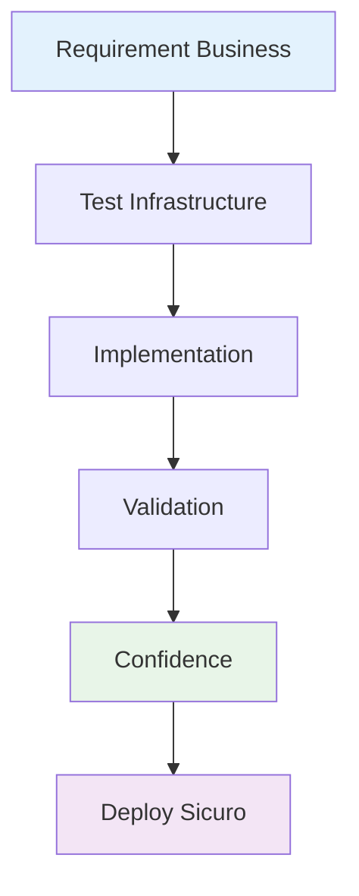
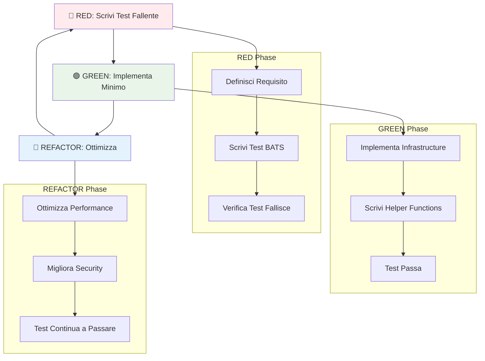

# 📚 Documento di Onboarding per Nuovi Sviluppatori

## 📁 Posizione Suggerita e Nome File

**Path**: `docs/development/getting-started.md`

**Struttura directory**:

```
docs/
├── development/
│   ├── getting-started.md          # <-- QUESTO FILE
│   ├── infrastructure-testing.md   # Approfondimento BATS
│   ├── coding-standards.md
│   └── troubleshooting.md
├── architecture/
├── deployment/
└── monitoring/
```

---

# 🚀 Getting Started - Developer Onboarding Guide

> **Benvenuto nel progetto Scalable NestJS Application!**
> Questa guida ti porterà da zero a produttivo in meno di 30 minuti.

## 🎯 Panoramica del Progetto

Questo progetto implementa un'**architettura scalabile** per applicazioni enterprise usando **Test-Driven Development (TDD)** anche per l'infrastruttura. Non è "solo" un'app NestJS - è un sistema completo che dimostra come costruire software che scala realmente.

### 🧠 Filosofia: Perché TDD per Infrastructure?



**Tradizionale**: Costruisci → Spera che funzioni → Debug in produzione
**TDD Infrastructure**: Definisci comportamento → Implementa → Valida → Deploy con fiducia

## 🛠️ Prerequisiti Sistema (Linux)

### Software Essenziali

```bash
# 1. Docker & Docker Compose
sudo apt-get update
sudo apt-get install -y docker.io docker-compose
sudo systemctl start docker
sudo systemctl enable docker
sudo usermod -aG docker $USER

# 2. Node.js (via NodeSource)
curl -fsSL https://deb.nodesource.com/setup_20.x | sudo -E bash -
sudo apt-get install -y nodejs

# 3. BATS (Bash Automated Testing System)
sudo apt-get install -y bats

# 4. ShellCheck (per quality code)
sudo apt-get install -y shellcheck

# 5. Git (se non presente)
sudo apt-get install -y git

# 6. Utilities comuni
sudo apt-get install -y curl wget jq make
```

### Verifiche Post-Installazione

```bash
# Verifica tutto funzioni
echo "=== System Check ==="
docker --version
node --version
npm --version
bats --version
shellcheck --version
git --version

# Test Docker daemon
docker info >/dev/null && echo "✅ Docker OK" || echo "❌ Docker KO"

# Test permessi Docker (importante!)
docker run hello-world && echo "✅ Docker permissions OK" || echo "❌ Need: sudo usermod -aG docker $USER"
```

## 🏗️ Architettura del Progetto

### Struttura Directory Principale

```
scalable-nestjs-app/
├── 📁 src/                    # Codice applicazione NestJS
├── 📁 test/                   # Test automatizzati
│   ├── 📁 helpers/            # Utility functions riutilizabili
│   ├── 📁 infrastructure/     # Test per Docker/Swarm/Deploy
│   └── 📁 fixtures/           # Dati e config per test
├── 📁 scripts/                # Automazione e utility
├── 📁 docs/                   # Documentazione progetto
└── 📁 infrastructure/         # Docker, monitoring, CI/CD
```

### 🔬 Cosa Sono i File BATS?

**BATS** = **B**ash **A**utomated **T**esting **S**ystem

Pensa a BATS come "Jest per Bash". Invece di testare funzioni JavaScript, testiamo comandi bash e infrastruttura.

#### Anatomia di un Test BATS

```bash
#!/usr/bin/env bats

# Carica utility functions
load '../../helpers/docker-helpers'

# Setup prima di ogni test
setup() {
    cleanup_docker_environment
}

# Un singolo test
@test "Docker Swarm si inizializza correttamente" {
    # Given (Dato che...)
    run is_swarm_active
    [ "$status" -eq 1 ]  # Non deve essere attivo inizialmente

    # When (Quando...)
    run init_swarm_cluster
    [ "$status" -eq 0 ]  # Comando deve avere successo

    # Then (Allora...)
    run is_swarm_active
    [ "$status" -eq 0 ]  # Ora deve essere attivo
}
```

#### Perché BATS invece di Script Bash Normali?

| Aspetto        | Script Bash | BATS                |
| -------------- | ----------- | ------------------- |
| Struttura      | Libera      | Standardizzata      |
| Error Handling | Manuale     | Automatico          |
| Reporting      | Echo custom | Report JUnit        |
| Isolamento     | Nessuno     | Ogni test isolato   |
| CI/CD          | Complesso   | Integrazione nativa |

## 🔄 Flusso di Sviluppo TDD Infrastructure



## 🚀 Quick Start (5 minuti)

### 1. Clone e Setup

```bash
# Clone del progetto
git clone <repository-url>
cd backend-nestjs-boileplate

# Installa dipendenze Node
npm install

# Verifica struttura progetto
ls -la test/infrastructure/cluster/
ls -la test/helpers/
```

### 2. Primo Test Run

```bash
# Valida sintassi di tutti gli script
./scripts/validate-syntax.sh

# Esegui test infrastructure base
bats test/infrastructure/cluster/test-cluster-init.bats

# Output atteso:
# ✓ Docker is available and running
# ✓ Docker Swarm cluster can be initialized
# ✓ Swarm cluster has manager node
# ✓ Swarm cluster can generate join tokens
# ✓ Swarm cluster survives leave and rejoin
# 5 tests, 0 failures
```

### 3. Esplora le Helper Functions

```bash
# Carica le funzioni per test manuale
source test/helpers/docker-helpers.bash

# Testa funzioni base
validate_docker_available && echo "Docker OK"
get_primary_ip
init_swarm_cluster
```

### 4. Deploy del Monitoring Stack (Opzionale)

```bash
# Deploy completo dello stack di monitoring
make deploy-monitoring

# Verifica il deploy
make status-monitoring

# Accedi ai servizi:
# - Grafana: http://localhost:3000 (admin/admin)
# - Prometheus: http://localhost:9090
# - Portainer: http://localhost:9000

# Cleanup quando finito
make cleanup-monitoring
```

**Nota**: Per la documentazione completa del monitoring, vedi [docs/monitoring/README.md](../monitoring/README.md).

## 🧩 Componenti Chiave da Capire

### Helper Functions (`test/helpers/docker-helpers.bash`)

**Cosa sono**: Libreria di funzioni riutilizabili per gestire Docker Swarm
**Perché servono**: Evitano duplicazione codice, forniscono API consistente

```bash
# Funzioni principali:
init_swarm_cluster()           # Inizializza cluster Swarm
is_swarm_active()             # Verifica se Swarm è attivo
cleanup_docker_environment()  # Pulizia completa ambiente
validate_docker_available()   # Verifica Docker funzionante
```

### Test Fixtures (`test/fixtures/`)

**Cosa sono**: File di configurazione Docker Compose per test
**Perché servono**: Ambienti controllati e riproducibili per test

### Scripts di Automazione (`scripts/`)

```bash
validate-syntax.sh           # Valida sintassi tutti file bash
run-infrastructure-tests.sh  # Esegue suite completa test infrastructure
```

## 🔍 Debugging e Troubleshooting Comuni

### Problema: "Docker daemon not running"

```bash
# Verifica stato
systemctl status docker

# Avvia se necessario
sudo systemctl start docker

# Verifica permessi utente
groups $USER | grep docker || echo "Manca gruppo docker"
```

### Problema: "BATS command not found"

```bash
# Installa BATS
sudo apt-get install bats

# Oppure da source
git clone https://github.com/bats-core/bats-core.git
cd bats-core
sudo ./install.sh /usr/local
```

### Problema: "Permission denied - Docker"

```bash
# Aggiungi utente al gruppo docker
sudo usermod -aG docker $USER

# Ricarica gruppi (o logout/login)
newgrp docker

# Verifica
docker run hello-world
```

### Problema: Test BATS Falliscono

```bash
# Debug modalità verbosa
bats -t test/infrastructure/cluster/test-cluster-init.bats

# Test manuale delle funzioni
source test/helpers/docker-helpers.bash
validate_docker_available
```

## 🎯 Workflow di Sviluppo Tipico

### Per Nuove Feature Infrastructure

```bash
# 1. Crea branch feature
git checkout -b feature/new-monitoring

# 2. Scrivi test che fallisce (RED)
# Edita: test/infrastructure/monitoring/test-prometheus.bats

# 3. Esegui test per verificare fallimento
bats test/infrastructure/monitoring/test-prometheus.bats

# 4. Implementa feature (GREEN)
# Crea: infrastructure/monitoring/prometheus.yml

# 5. Test passa?
bats test/infrastructure/monitoring/test-prometheus.bats

# 6. Refactor e ottimizza (REFACTOR)
# Migliora implementazione mantenendo test verdi

# 7. Commit e PR
git add .
git commit -m "feat: add Prometheus monitoring with TDD"
```

### Per Bug Fix

```bash
# 1. Riproduci bug con test
# 2. Test fallisce (conferma bug)
# 3. Fix implementazione
# 4. Test passa (bug risolto)
# 5. Commit fix
```

## 📊 Metriche di Successo

### Onboarding Riuscito Se

- [ ] Tutti i prerequisiti installati e funzionanti
- [ ] Test `test-cluster-init.bats` passa (5/5)
- [ ] Comprendi il ciclo RED-GREEN-REFACTOR
- [ ] Riesci a leggere e modificare file BATS
- [ ] Docker Swarm si inizializza correttamente
- [ ] Helper functions caricate e utilizzabili

### Prossimi Step di Apprendimento

1. **Approfondisci BATS**: Leggi `docs/development/infrastructure-testing.md`
2. **Studia Helper Functions**: Analizza `test/helpers/docker-helpers.bash`
3. **Aggiungi un Test**: Crea un nuovo test seguendo i pattern esistenti
4. **Esplora NestJS**: Passa al codice applicazione in `src/`

## 🆘 Hai Bisogno di Aiuto?

### Risorse Utili

- **BATS Documentation**: <https://github.com/bats-core/bats-core>
- **Docker Swarm Guide**: <https://docs.docker.com/engine/swarm/>
- **TDD Infrastructure Patterns**: `docs/architecture/tdd-infrastructure.md`

### Contatti Team

- **Tech Lead**: [Nome] - [Email]
- **DevOps**: [Nome] - [Email]
- **Slack Channel**: #infrastructure-help

---

## 🎉 Benvenuto nel Team

Ora hai tutte le basi per contribuire efficacemente al progetto. Il TDD per infrastructure può sembrare diverso all'inizio, ma presto scoprirai quanto aumenta la fiducia e la velocità di sviluppo.

**Happy Coding!** 🚀

---

_Documento aggiornato: [Data]_
_Versione: 1.0_

---

## 🔧 Case Study: Risoluzione "TEST_STACK_NAME: unbound variable"

### Problema Reale Risolto ✅

**Situazione**: Test infrastructure fallivano con errore `TEST_STACK_NAME: unbound variable`

```bash
✗ INTEGRATION: Cluster + Service deployment end-to-end
  (in test file test/infrastructure/cluster/test-cluster-with-services.bats, line 25)
    `run deploy_test_service "$TEST_STACK_NAME"' failed
  /tmp/bats.247642.src: line 25: TEST_STACK_NAME: unbound variable
```

### Root Cause Analysis

**Problema**: Variabili esportate in `setup_file()` non sempre visibili nei singoli test BATS a causa di:

- Gestione subshell di BATS
- Isolamento test
- Scope variables

### Soluzione TDD Applicata

#### 🔴 RED Phase: Test Failing

```bash
make test-infra-visibility
# ❌ 2 tests, 2 failures - TEST_STACK_NAME unbound
```

#### 🟢 GREEN Phase: Helper Functions Pattern

```bash
# Pattern risolto con helper function
get_test_stack_name() {
    echo "${TEST_STACK_NAME:-visibility-test}"
}

@test "Test name" {
    local TEST_STACK_NAME
    TEST_STACK_NAME=$(get_test_stack_name)
    # Ora la variabile è sempre definita e accessibile
}
```

#### 🔵 REFACTOR Phase: SOLID Principles

- **SRP**: `get_test_stack_name()` singola responsabilità
- **OCP**: `deploy_test_service()` aperta per estensione
- **DIP**: Dipendenza da astrazioni (helper functions)

### Risultato Finale ✅

```bash
make test-infra-visibility
✓ INTEGRATION: Cluster + Service deployment end-to-end
✓ INTEGRATION: Service scaling works correctly
2 tests, 0 failures

ID             NAME              MODE         REPLICAS   IMAGE          PORTS
ke88losc9bao   visibility-test   replicated   3/3        nginx:alpine   *:8080->80/tcp
```

### Lesson Learned 🎯

- **Helper functions > Global variables** per reliability
- **Local variable pattern** garantisce scope consistente
- **TDD methodology** previene regressioni future
- **SOLID principles** applicabili anche agli script infrastructure

### Quick Reference: Variable Scope in BATS

| Pattern                | Robustezza         | Maintenance     | Raccomandazione      |
| ---------------------- | ------------------ | --------------- | -------------------- |
| `export` in setup_file | ⚠️ Inconsistente   | ❌ Difficile    | ❌ Evitare           |
| Global variables       | ⚠️ Race conditions | ❌ Side effects | ❌ Evitare           |
| **Helper functions**   | ✅ **Affidabile**  | ✅ **Clean**    | ✅ **Usare**         |
| Local + Helper         | ✅ **Bulletproof** | ✅ **SOLID**    | ✅ **Best Practice** |

---
