# 🧪 BATS Infrastructure Testing - Guida Completa

## 📁 Posizione File

**Path**: `docs/development/infrastructure-testing.md`

---

# 🔬 BATS Infrastructure Testing: Da Zero a Expert

> **BATS (Bash Automated Testing System)** è il cuore del nostro approccio TDD Infrastructure.
> Questa guida ti trasformerà da principiante a esperto nella scrittura di test infrastructure robusti e affidabili.

## 🎯 Perché BATS? L'Evoluzione del Testing Infrastructure

### 🤔 Il Problema Tradizionale

```mermaid
graph TD
    A[Deploy Script] --> B{Funziona?}
    B -->|No| C[Debug Manuale]
    B -->|Sì| D[Deploy Produzione]
    D --> E{Problemi Produzione?}
    E -->|Sì| F[Hotfix Urgente]
    E -->|No| G[Tutto OK... per ora]

    C --> H[Fix Script]
    H --> A
    F --> A

    style C fill:#ffebee
    style F fill:#ffebee
    style E fill:#fff3e0
```



**Problemi dell'approccio tradizionale:**

- Testing manuale lento e soggetto a errori
- Script "speranza-driven" senza validazione
- Debug in produzione costoso e rischioso
- Nessuna regressione prevention
- Knowledge silos (solo chi ha scritto lo script sa come funziona)

### ✅ La Soluzione BATS + TDD

```mermaid
graph TD
    A[Requirement] --> B[Scrivi Test BATS]
    B --> C[Test Fallisce RED]
    C --> D[Implementa Script]
    D --> E[Test Passa GREEN]
    E --> F[Refactor BLUE]
    F --> G[Deploy Confidence]

    G --> H{Nuovo Requirement?}
    H -->|Sì| A
    H -->|No| I[Produzione Stabile]

    style B fill:#e8f5e8
    style E fill:#e8f5e8
    style G fill:#e3f2fd
    style I fill:#e8f5e8
```



**Vantaggi dell'approccio TDD:**

- **Confidence**: Ogni deploy è validato automaticamente
- **Documentation**: I test sono documentazione eseguibile
- **Regression Prevention**: Modifiche future non rompono funzionalità esistenti
- **Knowledge Sharing**: Chiunque può capire cosa fa l'infrastruttura leggendo i test
- **Faster Debugging**: Problemi identificati immediatamente, non in produzione

## 🏗️ Architettura BATS nel Nostro Progetto

### 📂 Struttura Directory Test

```
test/
├── 📁 helpers/                    # Funzioni riutilizabili
│   ├── docker-helpers.bash        # Gestione Docker/Swarm
│   ├── monitoring-helpers.bash    # Setup Prometheus/Grafana
│   ├── logging-helpers.bash       # Validazione ELK Stack
│   └── common-helpers.bash        # Utilities generiche
├── 📁 infrastructure/             # Test Infrastructure
│   ├── 📁 cluster/               # Docker Swarm Tests
│   │   ├── test-cluster-init.bats
│   │   ├── test-cluster-scaling.bats
│   │   └── test-cluster-recovery.bats
│   ├── 📁 monitoring/            # Monitoring Stack Tests
│   │   ├── test-prometheus.bats
│   │   ├── test-grafana.bats
│   │   └── test-alerts.bats
│   ├── 📁 logging/               # Logging Infrastructure Tests
│   │   ├── test-elk-stack.bats
│   │   ├── test-log-aggregation.bats
│   │   └── test-curl-replication.bats
│   └── 📁 deployment/            # CI/CD Pipeline Tests
│       ├── test-deployment.bats
│       ├── test-rollback.bats
│       └── test-blue-green.bats
├── 📁 fixtures/                   # Dati e configurazioni test
│   ├── docker-compose.test.yml
│   ├── prometheus.test.yml
│   └── sample-logs.json
└── 📁 reports/                   # Report test eseguiti
    ├── infrastructure-report.xml
    └── coverage-report.html
```

### 🔄 Flusso di Esecuzione Test


## 📚 BATS Syntax: Dal Básico all'Avanzato

### 🌱 Livello Base: Primi Test

```bash
#!/usr/bin/env bats

# Test più semplice possibile
@test "Docker è disponibile" {
    run docker --version
    [ "$status" -eq 0 ]
}

# Test con messaggio di errore personalizzato
@test "Node.js versione corretta" {
    run node --version
    [ "$status" -eq 0 ]
    [[ "$output" =~ "v18" ]] || fail "Expected Node.js v18, got: $output"
}
```

### 🌿 Livello Intermedio: Setup e Helpers

```bash
#!/usr/bin/env bats

# Caricamento helper functions
load '../helpers/docker-helpers'
load '../helpers/common-helpers'

# Setup eseguito prima di ogni test
setup() {
    # Cleanup ambiente precedente
    cleanup_docker_environment

    # Setup variabili test
    export TEST_CONTAINER_NAME="test-app-$(random_string 8)"
    export TEST_NETWORK="test-network-$(random_string 8)"
}

# Teardown eseguito dopo ogni test
teardown() {
    # Cleanup delle risorse create
    docker container rm -f "$TEST_CONTAINER_NAME" 2>/dev/null || true
    docker network rm "$TEST_NETWORK" 2>/dev/null || true
}

@test "Container si avvia con configurazione corretta" {
    # Given: Configurazione container
    local image="nginx:alpine"
    local port="8080"

    # When: Avvio container
    run docker run -d \
        --name "$TEST_CONTAINER_NAME" \
        --network "$TEST_NETWORK" \
        -p "$port:80" \
        "$image"

    # Then: Verifiche multiple
    [ "$status" -eq 0 ]

    # Container è running
    run docker ps --filter "name=$TEST_CONTAINER_NAME" --format "{{.Status}}"
    [[ "$output" =~ "Up" ]]

    # Porta è accessibile
    run curl -s -o /dev/null -w "%{http_code}" "http://localhost:$port"
    [ "$output" = "200" ]
}
```

### 🌳 Livello Avanzato: Pattern Complessi

```bash
#!/usr/bin/env bats

load '../helpers/docker-helpers'
load '../helpers/monitoring-helpers'

# Setup più complesso con retry logic
setup() {
    export SWARM_CLUSTER_NAME="test-cluster-$(random_string 8)"
    export PROMETHEUS_PORT="9090"
    export GRAFANA_PORT="3000"

    # Inizializza cluster con retry
    retry 3 init_swarm_cluster "$SWARM_CLUSTER_NAME"
}

@test "Monitoring stack si deploy completamente e comunica" {
    # Given: Stack monitoring definito
    local stack_file="test/fixtures/monitoring-stack.yml"
    local stack_name="monitoring-test"

    # When: Deploy stack
    run docker stack deploy -c "$stack_file" "$stack_name"
    [ "$status" -eq 0 ]

    # Then: Verifica servizi sono healthy
    local services=("prometheus" "grafana" "node-exporter")

    for service in "${services[@]}"; do
        # Attendi servizio ready con timeout
        wait_for_service_ready "$stack_name"_"$service" 300

        # Verifica replicas attese
        local expected_replicas=$(get_service_replicas "$stack_name"_"$service")
        local actual_replicas=$(get_running_replicas "$stack_name"_"$service")
        [ "$actual_replicas" -eq "$expected_replicas" ]
    done

    # Verifica comunicazione tra servizi
    run test_prometheus_targets_healthy
    [ "$status" -eq 0 ]

    # Verifica Grafana può interrogare Prometheus
    run test_grafana_datasource_connection
    [ "$status" -eq 0 ]
}

# Test di scenario complesso: Auto-scaling
@test "Auto-scaling risponde a carico CPU elevato" {
    # Given: Servizio con auto-scaling configurato
    local service_name="web-app"
    local initial_replicas=3
    local max_replicas=10

    deploy_service_with_autoscaling "$service_name" "$initial_replicas" "$max_replicas"

    # When: Simula carico CPU elevato
    run generate_cpu_load "$service_name" 80  # 80% CPU
    [ "$status" -eq 0 ]

    # Then: Verifica scaling automatico
    # Attendi scaling trigger (max 300 secondi)
    local timeout=300
    local start_time=$(date +%s)

    while true; do
        local current_replicas=$(get_running_replicas "$service_name")

        # Scaling avvenuto?
        if [ "$current_replicas" -gt "$initial_replicas" ]; then
            break
        fi

        # Timeout check
        local current_time=$(date +%s)
        local elapsed=$((current_time - start_time))
        if [ "$elapsed" -gt "$timeout" ]; then
            fail "Auto-scaling non avvenuto entro $timeout secondi"
        fi

        sleep 10
    done

    # Verifica che scaling sia proporzionale al carico
    local final_replicas=$(get_running_replicas "$service_name")
    [ "$final_replicas" -le "$max_replicas" ]
    [ "$final_replicas" -gt "$initial_replicas" ]
}
```

## 🛠️ Helper Functions: La Libreria del Successo

### 🎯 Principio DRY (Don't Repeat Yourself)

```bash
# ❌ ANTI-PATTERN: Duplicazione codice
@test "Test 1" {
    docker swarm init --advertise-addr $(docker info --format '{{.Swarm.NodeAddr}}')
    # ... resto del test
}

@test "Test 2" {
    docker swarm init --advertise-addr $(docker info --format '{{.Swarm.NodeAddr}}')
    # ... resto del test
}

# ✅ PATTERN CORRETTO: Helper function
# In helpers/docker-helpers.bash:
init_swarm_cluster() {
    local advertise_addr
    advertise_addr=$(get_primary_ip)
    docker swarm init --advertise-addr "$advertise_addr"
}

# Nei test:
@test "Test 1" {
    init_swarm_cluster
    # ... resto del test
}
```

### 🧩 Esempio Helper Function Completa

```bash
# File: test/helpers/docker-helpers.bash

# Inizializza cluster Swarm con error handling
init_swarm_cluster() {
    local advertise_addr="${1:-}"

    # Se non specificato, detecta IP automaticamente
    if [[ -z "$advertise_addr" ]]; then
        advertise_addr=$(get_primary_ip)
    fi

    # Verifica che Docker sia disponibile
    if ! validate_docker_available; then
        return 1
    fi

    # Se Swarm già attivo, fai leave prima
    if is_swarm_active; then
        docker swarm leave --force >/dev/null 2>&1 || true
    fi

    # Inizializza nuovo cluster
    docker swarm init --advertise-addr "$advertise_addr" >/dev/null 2>&1

    # Verifica successo
    is_swarm_active
}

# Verifica se Swarm è attivo
is_swarm_active() {
    docker info --format '{{.Swarm.LocalNodeState}}' 2>/dev/null | grep -q "active"
}

# Ottieni IP primario della macchina
get_primary_ip() {
    # Prova diversi metodi per robustezza
    local ip

    # Metodo 1: Via default route
    ip=$(ip route get 1.1.1.1 2>/dev/null | awk '{print $7; exit}')
    if [[ -n "$ip" && "$ip" =~ ^[0-9]+\.[0-9]+\.[0-9]+\.[0-9]+$ ]]; then
        echo "$ip"
        return 0
    fi

    # Metodo 2: Via hostname
    ip=$(hostname -I 2>/dev/null | awk '{print $1}')
    if [[ -n "$ip" && "$ip" =~ ^[0-9]+\.[0-9]+\.[0-9]+\.[0-9]+$ ]]; then
        echo "$ip"
        return 0
    fi

    # Fallback: localhost (per testing)
    echo "127.0.0.1"
}

# Cleanup completo ambiente Docker
cleanup_docker_environment() {
    # Stop e remove tutti i container
    local containers
    containers=$(docker ps -aq 2>/dev/null)
    if [[ -n "$containers" ]]; then
        docker stop $containers >/dev/null 2>&1 || true
        docker rm $containers >/dev/null 2>&1 || true
    fi

    # Leave swarm se attivo
    if is_swarm_active; then
        docker swarm leave --force >/dev/null 2>&1 || true
    fi

    # Cleanup networks custom
    local networks
    networks=$(docker network ls --filter "driver=overlay" --format "{{.Name}}" 2>/dev/null | grep -v "ingress")
    if [[ -n "$networks" ]]; then
        echo "$networks" | xargs -r docker network rm >/dev/null 2>&1 || true
    fi

    # Cleanup volumes orphan
    docker volume prune -f >/dev/null 2>&1 || true
}

# Attendi che servizio sia ready
wait_for_service_ready() {
    local service_name="$1"
    local timeout="${2:-120}"  # Default 2 minuti
    local interval="${3:-5}"   # Check ogni 5 secondi

    local start_time=$(date +%s)

    while true; do
        # Verifica stato servizio
        local ready_replicas
        ready_replicas=$(docker service ls --filter "name=$service_name" --format "{{.Replicas}}" 2>/dev/null)

        if [[ "$ready_replicas" =~ ^([0-9]+)/\1$ ]]; then
            # Tutte le repliche sono ready
            return 0
        fi

        # Check timeout
        local current_time=$(date +%s)
        local elapsed=$((current_time - start_time))
        if [[ "$elapsed" -gt "$timeout" ]]; then
            return 1
        fi

        sleep "$interval"
    done
}

# Genera stringa casuale per naming
random_string() {
    local length="${1:-8}"
    head /dev/urandom | tr -dc a-z0-9 | head -c "$length"
}

# Retry command con backoff
retry() {
    local attempts="$1"
    shift
    local cmd=("$@")

    for ((i=1; i<=attempts; i++)); do
        if "${cmd[@]}"; then
            return 0
        fi

        if [[ "$i" -lt "$attempts" ]]; then
            local delay=$((i * 2))  # Exponential backoff
            sleep "$delay"
        fi
    done

    return 1
}
```

## 🎯 Pattern TDD Infrastructure

### 🔴 RED Phase: Writing Failing Tests

```bash
# Test scenario: "Il sistema deve supportare zero-downtime deployment"
@test "Zero-downtime deployment mantiene servizio disponibile" {
    # Given: Servizio in running
    local service_name="web-api"
    local version_1="app:v1.0"
    local version_2="app:v2.0"

    deploy_service "$service_name" "$version_1" 3
    wait_for_service_ready "$service_name"

    # When: Upgrade a nuova versione
    run perform_rolling_update "$service_name" "$version_2"
    [ "$status" -eq 0 ]

    # Then: Servizio sempre raggiungibile durante update
    run verify_continuous_availability "$service_name" 300  # 5 minuti
    [ "$status" -eq 0 ]

    # And: Alla fine tutte le istanze sono versione nuova
    run verify_all_instances_version "$service_name" "$version_2"
    [ "$status" -eq 0 ]
}
```

**❌ Primo run**: Test fallisce perché `perform_rolling_update` e `verify_continuous_availability` non esistono ancora.

### 🟢 GREEN Phase: Minimal Implementation

```bash
# Implementazione minima in helpers/deployment-helpers.bash
perform_rolling_update() {
    local service_name="$1"
    local new_image="$2"

    # Update strategy più semplice possibile
    docker service update --image "$new_image" "$service_name"
}

verify_continuous_availability() {
    local service_name="$1"
    local duration="$2"
    local endpoint="http://localhost:8080/health"

    local start_time=$(date +%s)
    local end_time=$((start_time + duration))

    while [[ $(date +%s) -lt $end_time ]]; do
        if ! curl -s -f "$endpoint" >/dev/null; then
            return 1  # Servizio non disponibile
        fi
        sleep 1
    done

    return 0
}
```

**✅ Secondo run**: Test passa! Implementazione minima funziona.

### 🔵 REFACTOR Phase: Optimization

```bash
# Versione ottimizzata con configuration avanzata
perform_rolling_update() {
    local service_name="$1"
    local new_image="$2"
    local update_parallelism="${3:-1}"
    local update_delay="${4:-10s}"

    # Rolling update con controllo granulare
    docker service update \
        --image "$new_image" \
        --update-parallelism "$update_parallelism" \
        --update-delay "$update_delay" \
        --update-failure-action rollback \
        --update-monitor 30s \
        "$service_name"

    # Attendi completamento update
    wait_for_update_completion "$service_name"
}

verify_continuous_availability() {
    local service_name="$1"
    local duration="$2"
    local check_interval="${3:-1}"
    local endpoint="http://localhost:8080/health"
    local max_consecutive_failures="${4:-3}"

    local start_time=$(date +%s)
    local end_time=$((start_time + duration))
    local consecutive_failures=0

    while [[ $(date +%s) -lt $end_time ]]; do
        if curl -s -f "$endpoint" >/dev/null; then
            consecutive_failures=0
        else
            ((consecutive_failures++))
            if [[ $consecutive_failures -ge $max_consecutive_failures ]]; then
                return 1
            fi
        fi
        sleep "$check_interval"
    done

    return 0
}
```

**✅ Terzo run**: Test continua a passare, ma ora abbiamo implementazione production-ready!

## 🔧 Tool Integration e CI/CD

### 🚀 GitHub Actions Integration

```yaml
# File: .github/workflows/infrastructure-tests.yml
name: Infrastructure Tests

on:
  push:
    branches: [main, develop]
  pull_request:
    branches: [main]

jobs:
  infrastructure-tests:
    runs-on: ubuntu-latest

    steps:
      - uses: actions/checkout@v3

      - name: Setup BATS
        run: |
          sudo apt-get update
          sudo apt-get install -y bats

      - name: Setup Docker Buildx
        uses: docker/setup-buildx-action@v2

      - name: Run Infrastructure Tests
        run: |
          # Test sequenza organizzata
          echo "🔧 Testing cluster initialization..."
          bats test/infrastructure/cluster/test-cluster-init.bats

          echo "📊 Testing monitoring stack..."
          bats test/infrastructure/monitoring/test-*.bats

          echo "📋 Testing logging infrastructure..."
          bats test/infrastructure/logging/test-*.bats

          echo "🚀 Testing deployment pipeline..."
          bats test/infrastructure/deployment/test-*.bats

      - name: Generate Test Report
        if: always()
        run: |
          # Converte output BATS in JUnit XML per GitHub
          ./scripts/bats-to-junit.sh test/reports/

      - name: Upload Test Results
        if: always()
        uses: actions/upload-artifact@v3
        with:
          name: infrastructure-test-results
          path: test/reports/
```

### 📊 Makefile Integration

```makefile
# Makefile: Comandi rapidi per sviluppatori

.PHONY: test-infra test-infra-quick test-infra-full

# Test rapido (solo cluster)
test-infra-quick:
 @echo "🔧 Running quick infrastructure tests..."
 @bats test/infrastructure/cluster/test-cluster-init.bats

# Test completo infrastructure
test-infra:
 @echo "🧪 Running full infrastructure test suite..."
 @for dir in test/infrastructure/*/; do \
  echo "📁 Testing $$dir"; \
  bats "$$dir"test-*.bats; \
 done

# Test con cleanup forzato
test-infra-clean:
 @echo "🧹 Cleaning environment before tests..."
 @./scripts/cleanup-test-environment.sh
 @make test-infra

# Test con report dettagliato
test-infra-report:
 @echo "📊 Running tests with detailed reporting..."
 @mkdir -p test/reports
 @bats --formatter junit test/infrastructure/**/*.bats > test/reports/infrastructure-junit.xml
 @bats --formatter tap test/infrastructure/**/*.bats > test/reports/infrastructure-tap.log
 @echo "Reports generated in test/reports/"

# Validazione syntax tutti i file
validate-syntax:
 @echo "🔍 Validating bash syntax..."
 @find test/ -name "*.bash" -o -name "*.bats" | xargs -I {} bash -n {}
 @find scripts/ -name "*.sh" | xargs -I {} bash -n {}
 @echo "✅ All bash files have valid syntax"

# Help per sviluppatori
help:
 @echo "📚 Available infrastructure testing commands:"
 @echo "  test-infra-quick  - Run quick cluster tests only"
 @echo "  test-infra        - Run full infrastructure test suite"
 @echo "  test-infra-clean  - Clean environment and run tests"
 @echo "  test-infra-report - Run tests with detailed reporting"
 @echo "  validate-syntax   - Validate all bash/bats files syntax"
```

## 🐛 Debugging e Troubleshooting

### 🔍 Tecniche di Debug BATS

#### 1. Debug Verboso

```bash
# Esegui con output dettagliato
bats -t test/infrastructure/cluster/test-cluster-init.bats

# Output esempio:
# test-cluster-init.bats
#  ✓ Docker is available and running
#  ✗ Docker Swarm cluster can be initialized
#    (in test file test-cluster-init.bats, line 23)
#      `[ "$status" -eq 0 ]' failed
#    Docker command failed with status: 1
#    Output: Error response from daemon: This node is already part of a swarm
```

#### 2. Debug con Print Statements

```bash
@test "Debug example" {
    # Debug variabili
    echo "DEBUG: TEST_VAR=$TEST_VAR" >&3

    # Debug comando prima dell'esecuzione
    echo "DEBUG: About to run: docker swarm init" >&3

    run docker swarm init --advertise-addr "$(get_primary_ip)"

    # Debug output comando
    echo "DEBUG: Command status: $status" >&3
    echo "DEBUG: Command output: $output" >&3

    [ "$status" -eq 0 ]
}
```

#### 3. Test Isolation per Debug

```bash
# Crea test minimo per isolare problema
@test "Minimal reproduction test" {
    # Solo il pezzo che non funziona
    run get_primary_ip
    [ "$status" -eq 0 ]
    [[ "$output" =~ ^[0-9]+\.[0-9]+\.[0-9]+\.[0-9]+$ ]]
}
```

### 🚨 Errori Comuni e Soluzioni

#### Errore: "Docker daemon not running"

```bash
# Problema
@test "This will fail" {
    run docker ps
    [ "$status" -eq 0 ]  # ❌ Fallisce se Docker non running
}

# Soluzione: Validazione preliminare
setup() {
    validate_docker_available || skip "Docker not available"
}

@test "This will work or skip" {
    run docker ps
    [ "$status" -eq 0 ]  # ✅ Skip se Docker non disponibile
}
```

#### Errore: "Port already in use"

```bash
# Problema: Conflitti di porta tra test
@test "Service on port 8080" {
    run docker run -d -p 8080:80 nginx
    [ "$status" -eq 0 ]  # ❌ Fallisce se porta occupata
}

# Soluzione: Porte dinamiche
@test "Service on dynamic port" {
    local port
    port=$(get_free_port)

    run docker run -d -p "$port:80" nginx
    [ "$status" -eq 0 ]  # ✅ Usa porta libera
}

# Helper function
get_free_port() {
    python3 -c "import socket; s=socket.socket(); s.bind(('', 0)); print(s.getsockname()[1]); s.close()"
}
```

#### Errore: "Resource cleanup incomplete"

```bash
# Problema: Residui test precedenti
teardown() {
    docker rm -f "$TEST_CONTAINER" 2>/dev/null || true  # ❌ Cleanup parziale
}

# Soluzione: Cleanup robusto
teardown() {
    # Cleanup completo con retry
    local containers_to_clean
    containers_to_clean=$(docker ps -aq --filter "label=test-session=$TEST_SESSION")

    if [[ -n "$containers_to_clean" ]]; then
        docker stop $containers_to_clean >/dev/null 2>&1 || true
        docker rm $containers_to_clean >/dev/null 2>&1 || true
    fi

    # Cleanup networks
    docker network prune -f >/dev/null 2>&1 || true

    # Cleanup volumes
    docker volume prune -f >/dev/null 2>&1 || true
}
```

## 📈 Metriche e Monitoring Test

### 📊 Test Performance Tracking

```bash
# File: test/helpers/performance-helpers.bash

# Misura tempo esecuzione comando
measure_execution_time() {
    local cmd=("$@")
    local start_time end_time duration

    start_time=$(date +%s.%N)
    "${cmd[@]}"
    local exit_code=$?
    end_time=$(date +%s.%N)

    duration=$(echo "$end_time - $start_time" | bc)
    echo "PERFORMANCE: Command '${cmd[*]}' took ${duration}s" >&3

    return $exit_code
}

# Test con SLA timing
@test "Service startup rispetta SLA (<30 secondi)" {
    local start_time
    start_time=$(date +%s)

    run deploy_service "web-app" "nginx:alpine" 3
    [ "$status" -eq 0 ]

    wait_for_service_ready "web-app" 30
    local wait_status=$?

    local end_time duration
    end_time=$(date +%s)
    duration=$((end_time - start_time))

    echo "SERVICE_STARTUP_TIME: ${duration}s" >&3
    [ "$wait_status" -eq 0 ]
    [ "$duration" -le 30 ]
}
```

### 📋 Test Coverage Reporting

```bash
# Script: scripts/generate-test-coverage.sh
#!/bin/bash

echo "📊 Generating Infrastructure Test Coverage Report..."

# Conta test totali
total_tests=$(find test/infrastructure -name "*.bats" -exec grep -h "^@test" {} \; | wc -l)

# Conta test passati
passed_tests=$(bats test/infrastructure/**/*.bats 2>/dev/null | grep -c "✓")

# Calcola coverage
coverage=$((passed_tests * 100 / total_tests))

# Genera report
cat > test/reports/coverage-report.md << EOF
# Infrastructure Test Coverage Report

**Generated**: $(date)
**Total Tests**: $total_tests
**Passed Tests**: $passed_tests
**Coverage**: $coverage%

## Test Categories Coverage

$(generate_category_coverage)

## Failed Tests

$(list_failed_tests)
EOF

echo "✅ Coverage report generated: test/reports/coverage-report.md"
echo "📈 Current coverage: $coverage%"
```

## 🎓 Best Practices e Pattern Avanzati

### ✅ SOLID Principles per Test Infrastructure

#### 1. Single Responsibility Principle (SRP)

```bash
# ❌ ANTI-PATTERN: Test che fa troppe cose
@test "Massive test doing everything" {
    init_swarm_cluster
    deploy_monitoring_stack
    deploy_logging_stack
    test_auto_scaling
    test_zero_downtime_deployment
    verify_backup_system
    # ... troppo!
}

# ✅ PATTERN CORRETTO: Test focalizzati
@test "Swarm cluster initializes correctly" {
    run init_swarm_cluster
    [ "$status" -eq 0 ]
    run is_swarm_active
    [ "$status" -eq 0 ]
}

@test "Monitoring stack deploys successfully" {
    init_swarm_cluster  # Prerequisito
    run deploy_monitoring_stack
    [ "$status" -eq 0 ]
    wait_for_service_ready "prometheus"
}
```

#### 2. Open/Closed Principle (OCP)

```bash
# Base framework estensibile
# File: test/helpers/deployment-helpers.bash

# Funzione base - chiusa per modifiche
deploy_service_base() {
    local service_name="$1"
    local image="$2"
    local replicas="$3"

    docker service create \
        --name "$service_name" \
        --replicas "$replicas" \
        "$image"
}

# Estensioni - aperte per nuove funzionalità
deploy_service_with_monitoring() {
    local service_name="$1"
    local image="$2"
    local replicas="$3"

    deploy_service_base "$service_name" "$image" "$replicas"

    # Estensione: aggiungi monitoring labels
    docker service update \
        --label-add "monitoring=enabled" \
        --label-add "prometheus.scrape=true" \
        "$service_name"
}

deploy_service_with_autoscaling() {
    local service_name="$1"
    local image="$2"
    local min_replicas="$3"
    local max_replicas="$4"

    deploy_service_base "$service_name" "$image" "$min_replicas"

    # Estensione: aggiungi auto-scaling
    configure_service_autoscaling "$service_name" "$min_replicas" "$max_replicas"
}
```

#### 3. Dependency Inversion Principle (DIP)

```bash
# Abstraction layer per orchestrator
# File: test/helpers/orchestrator-interface.bash

# Interfaccia astratta
create_service() {
    case "$ORCHESTRATOR" in
        "swarm")
            create_service_swarm "$@"
            ;;
        "k8s")
            create_service_k8s "$@"
            ;;
        *)
            fail "Unsupported orchestrator: $ORCHESTRATOR"
            ;;
    esac
}

# Implementazioni concrete
create_service_swarm() {
    local name="$1" image="$2" replicas="$3"
    docker service create --name "$name" --replicas "$replicas" "$image"
}

create_service_k8s() {
    local name="$1" image="$2" replicas="$3"
    kubectl create deployment "$name" --image="$image" --replicas="$replicas"
}

# Test indipendenti dall'implementazione
@test "Service creates successfully regardless of orchestrator" {
    run create_service "test-app" "nginx:alpine" 3
    [ "$status" -eq 0 ]
}
```

### 🔄 Pattern Data-Driven Testing

```bash
# File: test/fixtures/scaling-scenarios.txt
# service_name,initial_replicas,target_replicas,expected_time
web-frontend,3,10,45
api-backend,5,15,60
data-processor,2,8,30

@test "Auto-scaling scenarios from data file" {
    # Data-driven test execution
    while IFS=',' read -r service_name initial_replicas target_replicas expected_time || [[ -n "$service_name" ]]; do
        # Skip commenti e righe vuote
        [[ "$service_name" =~ ^#.*$ ]] && continue
        [[ -z "$service_name" ]] && continue

        echo "Testing scaling: $service_name ($initial_replicas -> $target_replicas)" >&3

        # Setup servizio
        run deploy_service "$service_name" "nginx:alpine" "$initial_replicas"
        [ "$status" -eq 0 ]

        # Trigger scaling
        run scale_service "$service_name" "$target_replicas"
        [ "$status" -eq 0 ]

        # Verifica timing
        run wait_for_service_scaled "$service_name" "$target_replicas" "$expected_time"
        [ "$status" -eq 0 ]

        # Cleanup
        remove_service "$service_name"

    done < "test/fixtures/scaling-scenarios.txt"
}
```

## 🌐 NGINX Monitoring TDD Case Study

### Evoluzione del Testing Strategy

#### Problema Iniziale: Container Conflicts

Il primo approccio aveva problemi di architettura:

```bash
# ❌ APPROCCIO PROBLEMATICO (Versione iniziale)
@test "NGINX deve essere configurato" {
    # Ogni test creava un nuovo stack
    deploy_nginx_with_status_module "$TEST_STACK_NAME"

    # Problemi:
    # - Port 80 conflicts
    # - Port 9113 conflicts
    # - Container duplication
    # - Resource waste
}
```

**Problemi identificati:**

- Port conflicts tra stack multipli
- Container `nginx-exporter` duplicati
- Test environment ≠ production environment
- Complex deployment functions

#### Soluzione Elegante: Unified Stack Approach

```bash
# ✅ APPROCCIO UNIFICATO (Versione finale)
@test "NGINX deve essere configurato per esporre nginx_status" {
    # Given: Stack monitoring integrato già attivo
    init_swarm_cluster

    # When: Verifichiamo che lo stack monitoring sia attivo
    run docker service ls --filter name=monitoring_nginx --quiet
    [ "$status" -eq 0 ]

    # Then: L'endpoint nginx_status deve essere accessibile
    run curl -f http://localhost:80/nginx_status
    [ "$status" -eq 0 ]
    [[ "$output" =~ "Active connections:" ]]
}
```

**Vantaggi dell'approccio unificato:**

- ✅ Zero conflitti di porte/risorse
- ✅ Environment produzione-like
- ✅ Test più veloci (no deploy/cleanup)
- ✅ Codice più semplice e maintainabile

### TDD Requirements Implementation

#### Test Suite Overview

```bash
# Esegui tutti i test NGINX monitoring
bats test/monitoring/test-nginx-exporter-requirements.bats

# Output atteso:
✓ REQUIREMENT: NGINX deve essere configurato per esporre nginx_status
✓ REQUIREMENT: NGINX Exporter deve essere configurato e funzionante
✓ REQUIREMENT: Prometheus deve raccogliere metriche NGINX automaticamente
✓ REQUIREMENT: Grafana deve avere dashboard preconfigurata per NGINX
✓ REQUIREMENT: Sistema deve allertare su problemi critici NGINX
✓ REQUIREMENT: Load testing deve generare metriche visibili

6 tests, 0 failures
```

#### Detailed Requirements Analysis

**Requirement 1: NGINX Status Endpoint**

```bash
@test "REQUIREMENT: NGINX deve essere configurato per esporre nginx_status" {
    # Verifica che NGINX sia configurato con stub_status
    run curl -f http://localhost:80/nginx_status
    [ "$status" -eq 0 ]
    [[ "$output" =~ "Active connections:" ]]
    [[ "$output" =~ "server accepts handled requests" ]]
}
```

**Requirement 2: NGINX Exporter Integration**

```bash
@test "REQUIREMENT: NGINX Exporter deve essere configurato e funzionante" {
    # Verifica che l'exporter raccolga metriche Prometheus
    run curl -f http://localhost:9113/metrics
    [ "$status" -eq 0 ]
    [[ "$output" =~ "nginx_http_requests_total" ]]
    [[ "$output" =~ "nginx_connections_active" ]]
}
```

**Requirement 3: Prometheus Integration**

```bash
@test "REQUIREMENT: Prometheus deve raccogliere metriche NGINX automaticamente" {
    # Verifica integrazione con Prometheus
    run check_prometheus_target_up "nginx-exporter"
    [ "$status" -eq 0 ]
    run query_prometheus_metric "nginx_http_requests_total"
    [ "$status" -eq 0 ]
}
```

### Test Infrastructure Functions

#### Core Helper Functions

```bash
# monitoring-helpers.bash - Funzioni chiave

wait_for_monitoring_services() {
    local timeout="${1:-180}"
    local start_time=$(date +%s)

    local services=(
        "prometheus:is_prometheus_collecting"
        "grafana:is_grafana_configured"
        "nginx-exporter:is_nginx_monitored"
        "swarm-monitoring:is_swarm_monitored"
    )

    # Attesa intelligente con feedback
    while true; do
        local ready_count=0
        local total_services=${#services[@]}

        for service_check in "${services[@]}"; do
            local service_name="${service_check%%:*}"
            local check_function="${service_check##*:}"

            if $check_function 2>/dev/null; then
                ((ready_count++))
                echo "✅ $service_name ready"
            else
                echo "⏳ $service_name not ready yet"
            fi
        done

        if [ "$ready_count" -eq "$total_services" ]; then
            echo "🎉 All monitoring services are ready!"
            return 0
        fi

        # Timeout check con feedback
        local current_time=$(date +%s)
        local elapsed=$((current_time - start_time))

        if [ "$elapsed" -gt "$timeout" ]; then
            echo "❌ Timeout waiting for services. Ready: $ready_count/$total_services"
            return 1
        fi

        echo "📊 Services ready: $ready_count/$total_services (${elapsed}s elapsed)"
        sleep 10
    done
}
```

#### Specialized Validation Functions

```bash
# Verifica che NGINX exporter stia esponendo metriche
is_nginx_monitored() {
    local nginx_exporter_url="${1:-http://localhost:9113}"

    # Verifica che exporter risponda
    if ! curl -s "${nginx_exporter_url}/metrics" >/dev/null 2>&1; then
        return 1
    fi

    # Verifica che ci siano metriche nginx specifiche
    curl -s "${nginx_exporter_url}/metrics" | grep -q "nginx_http_requests_total"
}

# Query Prometheus per metrica specifica
query_prometheus_metric() {
    local metric_name="$1"
    local prometheus_url="${2:-http://localhost:9090}"

    local response
    response=$(curl -s "${prometheus_url}/api/v1/query?query=${metric_name}" 2>/dev/null)

    if [[ -z "$response" ]]; then
        return 1
    fi

    # Check if metric exists and has data
    if echo "$response" | grep -q '"status":"success"' && echo "$response" | grep -q "$metric_name"; then
        echo "$response"
        return 0
    fi

    return 1
}
```

### Load Testing & Metrics Validation

#### Traffic Generation Example

```bash
@test "REQUIREMENT: Load testing deve generare metriche visibili" {
    # Genera traffico per verificare le metriche
    run curl -f http://localhost
    [ "$status" -eq 0 ]

    # Attende l'update delle metriche
    sleep 10
    run curl -f http://localhost:9113/metrics
    [ "$status" -eq 0 ]
    [[ "$output" =~ "nginx_http_requests_total" ]]
}
```

#### Advanced Load Testing Function

```bash
simulate_traffic_load() {
    local rps="$1"
    local duration="$2"
    local nginx_url="${3:-http://localhost:80}"

    local end_time=$((SECONDS + duration))
    local count=0

    while [[ $SECONDS -lt $end_time ]]; do
        curl -s "$nginx_url/" >/dev/null 2>&1 &
        curl -s "$nginx_url/health" >/dev/null 2>&1 &

        count=$((count + 2))

        # Control rate (rough approximation)
        sleep $(echo "scale=3; 1/$rps" | bc -l 2>/dev/null || echo "0.01")
    done

    wait  # Aspetta completion di tutti i background jobs
    echo "Generated approximately $count requests over ${duration}s"
    return 0
}
```

### Best Practices Learned

#### 1. Architecture First, Implementation Second

```bash
# ✅ Design pattern che funziona
@test "Feature test" {
    # Given: Prerequisites clearly stated
    init_swarm_cluster

    # When: Action under test
    run docker service ls --filter name=monitoring_service

    # Then: Expected outcome verified
    [ "$status" -eq 0 ]
    [[ "$output" =~ "expected_pattern" ]]
}
```

#### 2. Meaningful Error Messages

```bash
# ✅ Test con diagnostica utile
@test "Service readiness check" {
    run wait_for_monitoring_services 120
    if [ "$status" -ne 0 ]; then
        echo "DEBUG: Service status:" >&3
        docker service ls >&3
        echo "DEBUG: Failed service logs:" >&3
        docker service logs monitoring_problematic_service >&3
    fi
    [ "$status" -eq 0 ]
}
```

#### 3. Test Independence & Cleanup

```bash
setup() {
    export TEST_STACK_NAME="nginx-exporter-test-$(random_string 8)"
    echo "🧪 Test setup: $TEST_STACK_NAME" >&3
}

teardown() {
    echo "🧹 Test cleanup: $TEST_STACK_NAME" >&3
    cleanup_monitoring_stack "$TEST_STACK_NAME" || true
    cleanup_nginx_stack "$TEST_STACK_NAME" || true
}
```

### Lessons Learned & Evolution

#### Anti-Patterns Identified

❌ **Container Multiplication**

```bash
# Ogni test creava nuovi container
deploy_nginx_with_status_module "$TEST_STACK_NAME"
deploy_nginx_exporter "$TEST_STACK_NAME"
deploy_monitoring_stack "$TEST_STACK_NAME"
# Risultato: 3x container, 3x conflitti
```

✅ **Unified Stack Pattern**

```bash
# Un solo stack integrato per tutti i test
run docker service ls --filter name=monitoring_nginx
run wait_for_monitoring_services 120
# Risultato: Zero conflitti, test più veloci
```

#### Performance Insights

| Approach            | Test Time  | Resource Usage          | Conflicts | Maintenance |
| ------------------- | ---------- | ----------------------- | --------- | ----------- |
| **Separate Stacks** | ~180s/test | High (3x containers)    | Frequent  | Complex     |
| **Unified Stack**   | ~30s/test  | Low (shared containers) | None      | Simple      |

#### Code Quality Improvements

**Before (Verbose & Brittle)**:

```bash
wait_for_complete_nginx_monitoring_stack() {
    wait_for_nginx_ready 60 || return 1
    wait_for_nginx_exporter_ready 60 || return 1
    wait_for_service_ready "prometheus" 120 || return 1
    wait_for_service_ready "grafana" 30 || return 1
}
```

**After (Clean & Robust)**:

```bash
wait_for_monitoring_services() {
    # Single function, intelligent waiting, comprehensive feedback
    # Handles all services uniformly
}
```

### Future Improvements

#### Planned Enhancements

1. **Grafana Dashboard Tests**
   - API-based dashboard validation
   - Panel data verification
   - Alert rule testing

2. **Advanced Load Testing**
   - Concurrent user simulation
   - Realistic traffic patterns
   - Performance baseline establishment

3. **Security Testing Integration**
   - SSL/TLS endpoint validation
   - Authentication flow testing
   - Authorization boundary testing

#### Integration Roadmap

```mermaid
graph TB
    A[NGINX Monitoring ✅] --> B[Application Integration]
    B --> C[Security Layer Testing]
    C --> D[Performance Benchmarking]
    D --> E[Chaos Engineering]
    E --> F[Production Readiness]

    style A fill:#c8e6c9
    style F fill:#81c784
```



---

**Case Study Summary**: La migrazione da approccio multi-stack a unified stack ha ridotto i tempi di test dell'85% eliminando completamente i conflitti di risorse, dimostrando l'importanza di un'architettura TDD ben progettata.
