# 🧪 BATS Infrastructure Testing - Guida Completa

## 📁 Posizione File

**Path**: `docs/development/infrastructure-testing.md`

---

# 🔬 BATS Infrastructure Testing: Da Zero a Expert

> **BATS (Bash Automated Testing System)** è il cuore del nostro approccio TDD Infrastructure.
> Questa guida ti trasformerà da principiante a esperto nella scrittura di test infrastructure robusti e affidabili.

## 🎯 Perché BATS? L'Evoluzione del Testing Infrastructure

### 🤔 Il Problema Tradizionale

```mermaid
graph TD
    A[Deploy Script] --> B{Funziona?}
    B -->|No| C[Debug Manuale]
    B -->|Sì| D[Deploy Produzione]
    D --> E{Problemi Produzione?}
    E -->|Sì| F[Hotfix Urgente]
    E -->|No| G[Tutto OK... per ora]

    C --> H[Fix Script]
    H --> A
    F --> A

    style C fill:#ffebee
    style F fill:#ffebee
    style E fill:#fff3e0
```



**Problemi dell'approccio tradizionale:**

- Testing manuale lento e soggetto a errori
- Script "speranza-driven" senza validazione
- Debug in produzione costoso e rischioso
- Nessuna regressione prevention
- Knowledge silos (solo chi ha scritto lo script sa come funziona)

### ✅ La Soluzione BATS + TDD

```mermaid
graph TD
    A[Requirement] --> B[Scrivi Test BATS]
    B --> C[Test Fallisce RED]
    C --> D[Implementa Script]
    D --> E[Test Passa GREEN]
    E --> F[Refactor BLUE]
    F --> G[Deploy Confidence]

    G --> H{Nuovo Requirement?}
    H -->|Sì| A
    H -->|No| I[Produzione Stabile]

    style B fill:#e8f5e8
    style E fill:#e8f5e8
    style G fill:#e3f2fd
    style I fill:#e8f5e8
```



**Vantaggi dell'approccio TDD:**

- **Confidence**: Ogni deploy è validato automaticamente
- **Documentation**: I test sono documentazione eseguibile
- **Regression Prevention**: Modifiche future non rompono funzionalità esistenti
- **Knowledge Sharing**: Chiunque può capire cosa fa l'infrastruttura leggendo i test
- **Faster Debugging**: Problemi identificati immediatamente, non in produzione

## 🏗️ Architettura BATS nel Nostro Progetto

### 📂 Struttura Directory Test

```
test/
├── 📁 helpers/                    # Funzioni riutilizabili
│   ├── docker-helpers.bash        # Gestione Docker/Swarm
│   ├── monitoring-helpers.bash    # Setup Prometheus/Grafana
│   ├── logging-helpers.bash       # Validazione ELK Stack
│   └── common-helpers.bash        # Utilities generiche
├── 📁 infrastructure/             # Test Infrastructure
│   ├── 📁 cluster/               # Docker Swarm Tests
│   │   ├── test-cluster-init.bats
│   │   ├── test-cluster-scaling.bats
│   │   └── test-cluster-recovery.bats
│   ├── 📁 monitoring/            # Monitoring Stack Tests
│   │   ├── test-prometheus.bats
│   │   ├── test-grafana.bats
│   │   └── test-alerts.bats
│   ├── 📁 logging/               # Logging Infrastructure Tests
│   │   ├── test-elk-stack.bats
│   │   ├── test-log-aggregation.bats
│   │   └── test-curl-replication.bats
│   └── 📁 deployment/            # CI/CD Pipeline Tests
│       ├── test-deployment.bats
│       ├── test-rollback.bats
│       └── test-blue-green.bats
├── 📁 fixtures/                   # Dati e configurazioni test
│   ├── docker-compose.test.yml
│   ├── prometheus.test.yml
│   └── sample-logs.json
└── 📁 reports/                   # Report test eseguiti
    ├── infrastructure-report.xml
    └── coverage-report.html
```

### 🔄 Flusso di Esecuzione Test


## 📚 BATS Syntax: Dal Básico all'Avanzato

### 🌱 Livello Base: Primi Test

```bash
#!/usr/bin/env bats

# Test più semplice possibile
@test "Docker è disponibile" {
    run docker --version
    [ "$status" -eq 0 ]
}

# Test con messaggio di errore personalizzato
@test "Node.js versione corretta" {
    run node --version
    [ "$status" -eq 0 ]
    [[ "$output" =~ "v18" ]] || fail "Expected Node.js v18, got: $output"
}
```

### 🌿 Livello Intermedio: Setup e Helpers

```bash
#!/usr/bin/env bats

# Caricamento helper functions
load '../helpers/docker-helpers'
load '../helpers/common-helpers'

# Setup eseguito prima di ogni test
setup() {
    # Cleanup ambiente precedente
    cleanup_docker_environment

    # Setup variabili test
    export TEST_CONTAINER_NAME="test-app-$(random_string 8)"
    export TEST_NETWORK="test-network-$(random_string 8)"
}

# Teardown eseguito dopo ogni test
teardown() {
    # Cleanup delle risorse create
    docker container rm -f "$TEST_CONTAINER_NAME" 2>/dev/null || true
    docker network rm "$TEST_NETWORK" 2>/dev/null || true
}

@test "Container si avvia con configurazione corretta" {
    # Given: Configurazione container
    local image="nginx:alpine"
    local port="8080"

    # When: Avvio container
    run docker run -d \
        --name "$TEST_CONTAINER_NAME" \
        --network "$TEST_NETWORK" \
        -p "$port:80" \
        "$image"

    # Then: Verifiche multiple
    [ "$status" -eq 0 ]

    # Container è running
    run docker ps --filter "name=$TEST_CONTAINER_NAME" --format "{{.Status}}"
    [[ "$output" =~ "Up" ]]

    # Porta è accessibile
    run curl -s -o /dev/null -w "%{http_code}" "http://localhost:$port"
    [ "$output" = "200" ]
}
```

### 🌳 Livello Avanzato: Pattern Complessi

```bash
#!/usr/bin/env bats

load '../helpers/docker-helpers'
load '../helpers/monitoring-helpers'

# Setup più complesso con retry logic
setup() {
    export SWARM_CLUSTER_NAME="test-cluster-$(random_string 8)"
    export PROMETHEUS_PORT="9090"
    export GRAFANA_PORT="3000"

    # Inizializza cluster con retry
    retry 3 init_swarm_cluster "$SWARM_CLUSTER_NAME"
}

@test "Monitoring stack si deploy completamente e comunica" {
    # Given: Stack monitoring definito
    local stack_file="test/fixtures/monitoring-stack.yml"
    local stack_name="monitoring-test"

    # When: Deploy stack
    run docker stack deploy -c "$stack_file" "$stack_name"
    [ "$status" -eq 0 ]

    # Then: Verifica servizi sono healthy
    local services=("prometheus" "grafana" "node-exporter")

    for service in "${services[@]}"; do
        # Attendi servizio ready con timeout
        wait_for_service_ready "$stack_name"_"$service" 300

        # Verifica replicas attese
        local expected_replicas=$(get_service_replicas "$stack_name"_"$service")
        local actual_replicas=$(get_running_replicas "$stack_name"_"$service")
        [ "$actual_replicas" -eq "$expected_replicas" ]
    done

    # Verifica comunicazione tra servizi
    run test_prometheus_targets_healthy
    [ "$status" -eq 0 ]

    # Verifica Grafana può interrogare Prometheus
    run test_grafana_datasource_connection
    [ "$status" -eq 0 ]
}

# Test di scenario complesso: Auto-scaling
@test "Auto-scaling risponde a carico CPU elevato" {
    # Given: Servizio con auto-scaling configurato
    local service_name="web-app"
    local initial_replicas=3
    local max_replicas=10

    deploy_service_with_autoscaling "$service_name" "$initial_replicas" "$max_replicas"

    # When: Simula carico CPU elevato
    run generate_cpu_load "$service_name" 80  # 80% CPU
    [ "$status" -eq 0 ]

    # Then: Verifica scaling automatico
    # Attendi scaling trigger (max 300 secondi)
    local timeout=300
    local start_time=$(date +%s)

    while true; do
        local current_replicas=$(get_running_replicas "$service_name")

        # Scaling avvenuto?
        if [ "$current_replicas" -gt "$initial_replicas" ]; then
            break
        fi

        # Timeout check
        local current_time=$(date +%s)
        local elapsed=$((current_time - start_time))
        if [ "$elapsed" -gt "$timeout" ]; then
            fail "Auto-scaling non avvenuto entro $timeout secondi"
        fi

        sleep 10
    done

    # Verifica che scaling sia proporzionale al carico
    local final_replicas=$(get_running_replicas "$service_name")
    [ "$final_replicas" -le "$max_replicas" ]
    [ "$final_replicas" -gt "$initial_replicas" ]
}
```

## 🛠️ Helper Functions: La Libreria del Successo

### 🎯 Principio DRY (Don't Repeat Yourself)

```bash
# ❌ ANTI-PATTERN: Duplicazione codice
@test "Test 1" {
    docker swarm init --advertise-addr $(docker info --format '{{.Swarm.NodeAddr}}')
    # ... resto del test
}

@test "Test 2" {
    docker swarm init --advertise-addr $(docker info --format '{{.Swarm.NodeAddr}}')
    # ... resto del test
}

# ✅ PATTERN CORRETTO: Helper function
# In helpers/docker-helpers.bash:
init_swarm_cluster() {
    local advertise_addr
    advertise_addr=$(get_primary_ip)
    docker swarm init --advertise-addr "$advertise_addr"
}

# Nei test:
@test "Test 1" {
    init_swarm_cluster
    # ... resto del test
}
```

### 🧩 Esempio Helper Function Completa

```bash
# File: test/helpers/docker-helpers.bash

# Inizializza cluster Swarm con error handling
init_swarm_cluster() {
    local advertise_addr="${1:-}"

    # Se non specificato, detecta IP automaticamente
    if [[ -z "$advertise_addr" ]]; then
        advertise_addr=$(get_primary_ip)
    fi

    # Verifica che Docker sia disponibile
    if ! validate_docker_available; then
        return 1
    fi

    # Se Swarm già attivo, fai leave prima
    if is_swarm_active; then
        docker swarm leave --force >/dev/null 2>&1 || true
    fi

    # Inizializza nuovo cluster
    docker swarm init --advertise-addr "$advertise_addr" >/dev/null 2>&1

    # Verifica successo
    is_swarm_active
}

# Verifica se Swarm è attivo
is_swarm_active() {
    docker info --format '{{.Swarm.LocalNodeState}}' 2>/dev/null | grep -q "active"
}

# Ottieni IP primario della macchina
get_primary_ip() {
    # Prova diversi metodi per robustezza
    local ip

    # Metodo 1: Via default route
    ip=$(ip route get 1.1.1.1 2>/dev/null | awk '{print $7; exit}')
    if [[ -n "$ip" && "$ip" =~ ^[0-9]+\.[0-9]+\.[0-9]+\.[0-9]+$ ]]; then
        echo "$ip"
        return 0
    fi

    # Metodo 2: Via hostname
    ip=$(hostname -I 2>/dev/null | awk '{print $1}')
    if [[ -n "$ip" && "$ip" =~ ^[0-9]+\.[0-9]+\.[0-9]+\.[0-9]+$ ]]; then
        echo "$ip"
        return 0
    fi

    # Fallback: localhost (per testing)
    echo "127.0.0.1"
}

# Cleanup completo ambiente Docker
cleanup_docker_environment() {
    # Stop e remove tutti i container
    local containers
    containers=$(docker ps -aq 2>/dev/null)
    if [[ -n "$containers" ]]; then
        docker stop $containers >/dev/null 2>&1 || true
        docker rm $containers >/dev/null 2>&1 || true
    fi

    # Leave swarm se attivo
    if is_swarm_active; then
        docker swarm leave --force >/dev/null 2>&1 || true
    fi

    # Cleanup networks custom
    local networks
    networks=$(docker network ls --filter "driver=overlay" --format "{{.Name}}" 2>/dev/null | grep -v "ingress")
    if [[ -n "$networks" ]]; then
        echo "$networks" | xargs -r docker network rm >/dev/null 2>&1 || true
    fi

    # Cleanup volumes orphan
    docker volume prune -f >/dev/null 2>&1 || true
}

# Attendi che servizio sia ready
wait_for_service_ready() {
    local service_name="$1"
    local timeout="${2:-120}"  # Default 2 minuti
    local interval="${3:-5}"   # Check ogni 5 secondi

    local start_time=$(date +%s)

    while true; do
        # Verifica stato servizio
        local ready_replicas
        ready_replicas=$(docker service ls --filter "name=$service_name" --format "{{.Replicas}}" 2>/dev/null)

        if [[ "$ready_replicas" =~ ^([0-9]+)/\1$ ]]; then
            # Tutte le repliche sono ready
            return 0
        fi

        # Check timeout
        local current_time=$(date +%s)
        local elapsed=$((current_time - start_time))
        if [[ "$elapsed" -gt "$timeout" ]]; then
            return 1
        fi

        sleep "$interval"
    done
}

# Genera stringa casuale per naming
random_string() {
    local length="${1:-8}"
    head /dev/urandom | tr -dc a-z0-9 | head -c "$length"
}

# Retry command con backoff
retry() {
    local attempts="$1"
    shift
    local cmd=("$@")

    for ((i=1; i<=attempts; i++)); do
        if "${cmd[@]}"; then
            return 0
        fi

        if [[ "$i" -lt "$attempts" ]]; then
            local delay=$((i * 2))  # Exponential backoff
            sleep "$delay"
        fi
    done

    return 1
}
```

## 🎯 Pattern TDD Infrastructure

### 🔴 RED Phase: Writing Failing Tests

```bash
# Test scenario: "Il sistema deve supportare zero-downtime deployment"
@test "Zero-downtime deployment mantiene servizio disponibile" {
    # Given: Servizio in running
    local service_name="web-api"
    local version_1="app:v1.0"
    local version_2="app:v2.0"

    deploy_service "$service_name" "$version_1" 3
    wait_for_service_ready "$service_name"

    # When: Upgrade a nuova versione
    run perform_rolling_update "$service_name" "$version_2"
    [ "$status" -eq 0 ]

    # Then: Servizio sempre raggiungibile durante update
    run verify_continuous_availability "$service_name" 300  # 5 minuti
    [ "$status" -eq 0 ]

    # And: Alla fine tutte le istanze sono versione nuova
    run verify_all_instances_version "$service_name" "$version_2"
    [ "$status" -eq 0 ]
}
```

**❌ Primo run**: Test fallisce perché `perform_rolling_update` e `verify_continuous_availability` non esistono ancora.

### 🟢 GREEN Phase: Minimal Implementation

```bash
# Implementazione minima in helpers/deployment-helpers.bash
perform_rolling_update() {
    local service_name="$1"
    local new_image="$2"

    # Update strategy più semplice possibile
    docker service update --image "$new_image" "$service_name"
}

verify_continuous_availability() {
    local service_name="$1"
    local duration="$2"
    local endpoint="http://localhost:8080/health"

    local start_time=$(date +%s)
    local end_time=$((start_time + duration))

    while [[ $(date +%s) -lt $end_time ]]; do
        if ! curl -s -f "$endpoint" >/dev/null; then
            return 1  # Servizio non disponibile
        fi
        sleep 1
    done

    return 0
}
```

**✅ Secondo run**: Test passa! Implementazione minima funziona.

### 🔵 REFACTOR Phase: Optimization

```bash
# Versione ottimizzata con configuration avanzata
perform_rolling_update() {
    local service_name="$1"
    local new_image="$2"
    local update_parallelism="${3:-1}"
    local update_delay="${4:-10s}"

    # Rolling update con controllo granulare
    docker service update \
        --image "$new_image" \
        --update-parallelism "$update_parallelism" \
        --update-delay "$update_delay" \
        --update-failure-action rollback \
        --update-monitor 30s \
        "$service_name"

    # Attendi completamento update
    wait_for_update_completion "$service_name"
}

verify_continuous_availability() {
    local service_name="$1"
    local duration="$2"
    local check_interval="${3:-1}"
    local endpoint="http://localhost:8080/health"
    local max_consecutive_failures="${4:-3}"

    local start_time=$(date +%s)
    local end_time=$((start_time + duration))
    local consecutive_failures=0

    while [[ $(date +%s) -lt $end_time ]]; do
        if curl -s -f "$endpoint" >/dev/null; then
            consecutive_failures=0
        else
            ((consecutive_failures++))
            if [[ $consecutive_failures -ge $max_consecutive_failures ]]; then
                return 1
            fi
        fi
        sleep "$check_interval"
    done

    return 0
}
```

**✅ Terzo run**: Test continua a passare, ma ora abbiamo implementazione production-ready!

## 🔧 Tool Integration e CI/CD

### 🚀 GitHub Actions Integration

```yaml
# File: .github/workflows/infrastructure-tests.yml
name: Infrastructure Tests

on:
  push:
    branches: [main, develop]
  pull_request:
    branches: [main]

jobs:
  infrastructure-tests:
    runs-on: ubuntu-latest

    steps:
      - uses: actions/checkout@v3

      - name: Setup BATS
        run: |
          sudo apt-get update
          sudo apt-get install -y bats

      - name: Setup Docker Buildx
        uses: docker/setup-buildx-action@v2

      - name: Run Infrastructure Tests
        run: |
          # Test sequenza organizzata
          echo "🔧 Testing cluster initialization..."
          bats test/infrastructure/cluster/test-cluster-init.bats

          echo "📊 Testing monitoring stack..."
          bats test/infrastructure/monitoring/test-*.bats

          echo "📋 Testing logging infrastructure..."
          bats test/infrastructure/logging/test-*.bats

          echo "🚀 Testing deployment pipeline..."
          bats test/infrastructure/deployment/test-*.bats

      - name: Generate Test Report
        if: always()
        run: |
          # Converte output BATS in JUnit XML per GitHub
          ./scripts/bats-to-junit.sh test/reports/

      - name: Upload Test Results
        if: always()
        uses: actions/upload-artifact@v3
        with:
          name: infrastructure-test-results
          path: test/reports/
```

### 📊 Makefile Integration

```makefile
# Makefile: Comandi rapidi per sviluppatori

.PHONY: test-infra test-infra-quick test-infra-full

# Test rapido (solo cluster)
test-infra-quick:
 @echo "🔧 Running quick infrastructure tests..."
 @bats test/infrastructure/cluster/test-cluster-init.bats

# Test completo infrastructure
test-infra:
 @echo "🧪 Running full infrastructure test suite..."
 @for dir in test/infrastructure/*/; do \
  echo "📁 Testing $$dir"; \
  bats "$$dir"test-*.bats; \
 done

# Test con cleanup forzato
test-infra-clean:
 @echo "🧹 Cleaning environment before tests..."
 @./scripts/cleanup-test-environment.sh
 @make test-infra

# Test con report dettagliato
test-infra-report:
 @echo "📊 Running tests with detailed reporting..."
 @mkdir -p test/reports
 @bats --formatter junit test/infrastructure/**/*.bats > test/reports/infrastructure-junit.xml
 @bats --formatter tap test/infrastructure/**/*.bats > test/reports/infrastructure-tap.log
 @echo "Reports generated in test/reports/"

# Validazione syntax tutti i file
validate-syntax:
 @echo "🔍 Validating bash syntax..."
 @find test/ -name "*.bash" -o -name "*.bats" | xargs -I {} bash -n {}
 @find scripts/ -name "*.sh" | xargs -I {} bash -n {}
 @echo "✅ All bash files have valid syntax"

# Help per sviluppatori
help:
 @echo "📚 Available infrastructure testing commands:"
 @echo "  test-infra-quick  - Run quick cluster tests only"
 @echo "  test-infra        - Run full infrastructure test suite"
 @echo "  test-infra-clean  - Clean environment and run tests"
 @echo "  test-infra-report - Run tests with detailed reporting"
 @echo "  validate-syntax   - Validate all bash/bats files syntax"
```

## 🐛 Debugging e Troubleshooting

### 🔍 Tecniche di Debug BATS

#### 1. Debug Verboso

```bash
# Esegui con output dettagliato
bats -t test/infrastructure/cluster/test-cluster-init.bats

# Output esempio:
# test-cluster-init.bats
#  ✓ Docker is available and running
#  ✗ Docker Swarm cluster can be initialized
#    (in test file test-cluster-init.bats, line 23)
#      `[ "$status" -eq 0 ]' failed
#    Docker command failed with status: 1
#    Output: Error response from daemon: This node is already part of a swarm
```

#### 2. Debug con Print Statements

```bash
@test "Debug example" {
    # Debug variabili
    echo "DEBUG: TEST_VAR=$TEST_VAR" >&3

    # Debug comando prima dell'esecuzione
    echo "DEBUG: About to run: docker swarm init" >&3

    run docker swarm init --advertise-addr "$(get_primary_ip)"

    # Debug output comando
    echo "DEBUG: Command status: $status" >&3
    echo "DEBUG: Command output: $output" >&3

    [ "$status" -eq 0 ]
}
```

#### 3. Test Isolation per Debug

```bash
# Crea test minimo per isolare problema
@test "Minimal reproduction test" {
    # Solo il pezzo che non funziona
    run get_primary_ip
    [ "$status" -eq 0 ]
    [[ "$output" =~ ^[0-9]+\.[0-9]+\.[0-9]+\.[0-9]+$ ]]
}
```

### 🚨 Errori Comuni e Soluzioni

#### Errore: "Docker daemon not running"

```bash
# Problema
@test "This will fail" {
    run docker ps
    [ "$status" -eq 0 ]  # ❌ Fallisce se Docker non running
}

# Soluzione: Validazione preliminare
setup() {
    validate_docker_available || skip "Docker not available"
}

@test "This will work or skip" {
    run docker ps
    [ "$status" -eq 0 ]  # ✅ Skip se Docker non disponibile
}
```

#### Errore: "Port already in use"

```bash
# Problema: Conflitti di porta tra test
@test "Service on port 8080" {
    run docker run -d -p 8080:80 nginx
    [ "$status" -eq 0 ]  # ❌ Fallisce se porta occupata
}

# Soluzione: Porte dinamiche
@test "Service on dynamic port" {
    local port
    port=$(get_free_port)

    run docker run -d -p "$port:80" nginx
    [ "$status" -eq 0 ]  # ✅ Usa porta libera
}

# Helper function
get_free_port() {
    python3 -c "import socket; s=socket.socket(); s.bind(('', 0)); print(s.getsockname()[1]); s.close()"
}
```

#### Errore: "Resource cleanup incomplete"

```bash
# Problema: Residui test precedenti
teardown() {
    docker rm -f "$TEST_CONTAINER" 2>/dev/null || true  # ❌ Cleanup parziale
}

# Soluzione: Cleanup robusto
teardown() {
    # Cleanup completo con retry
    local containers_to_clean
    containers_to_clean=$(docker ps -aq --filter "label=test-session=$TEST_SESSION")

    if [[ -n "$containers_to_clean" ]]; then
        docker stop $containers_to_clean >/dev/null 2>&1 || true
        docker rm $containers_to_clean >/dev/null 2>&1 || true
    fi

    # Cleanup networks
    docker network prune -f >/dev/null 2>&1 || true

    # Cleanup volumes
    docker volume prune -f >/dev/null 2>&1 || true
}
```

## 📈 Metriche e Monitoring Test

### 📊 Test Performance Tracking

```bash
# File: test/helpers/performance-helpers.bash

# Misura tempo esecuzione comando
measure_execution_time() {
    local cmd=("$@")
    local start_time end_time duration

    start_time=$(date +%s.%N)
    "${cmd[@]}"
    local exit_code=$?
    end_time=$(date +%s.%N)

    duration=$(echo "$end_time - $start_time" | bc)
    echo "PERFORMANCE: Command '${cmd[*]}' took ${duration}s" >&3

    return $exit_code
}

# Test con SLA timing
@test "Service startup rispetta SLA (<30 secondi)" {
    local start_time
    start_time=$(date +%s)

    run deploy_service "web-app" "nginx:alpine" 3
    [ "$status" -eq 0 ]

    wait_for_service_ready "web-app" 30
    local wait_status=$?

    local end_time duration
    end_time=$(date +%s)
    duration=$((end_time - start_time))

    echo "SERVICE_STARTUP_TIME: ${duration}s" >&3
    [ "$wait_status" -eq 0 ]
    [ "$duration" -le 30 ]
}
```

### 📋 Test Coverage Reporting

```bash
# Script: scripts/generate-test-coverage.sh
#!/bin/bash

echo "📊 Generating Infrastructure Test Coverage Report..."

# Conta test totali
total_tests=$(find test/infrastructure -name "*.bats" -exec grep -h "^@test" {} \; | wc -l)

# Conta test passati
passed_tests=$(bats test/infrastructure/**/*.bats 2>/dev/null | grep -c "✓")

# Calcola coverage
coverage=$((passed_tests * 100 / total_tests))

# Genera report
cat > test/reports/coverage-report.md << EOF
# Infrastructure Test Coverage Report

**Generated**: $(date)
**Total Tests**: $total_tests
**Passed Tests**: $passed_tests
**Coverage**: $coverage%

## Test Categories Coverage

$(generate_category_coverage)

## Failed Tests

$(list_failed_tests)
EOF

echo "✅ Coverage report generated: test/reports/coverage-report.md"
echo "📈 Current coverage: $coverage%"
```

## 🎓 Best Practices e Pattern Avanzati

### ✅ SOLID Principles per Test Infrastructure

#### 1. Single Responsibility Principle (SRP)

```bash
# ❌ ANTI-PATTERN: Test che fa troppe cose
@test "Massive test doing everything" {
    init_swarm_cluster
    deploy_monitoring_stack
    deploy_logging_stack
    test_auto_scaling
    test_zero_downtime_deployment
    verify_backup_system
    # ... troppo!
}

# ✅ PATTERN CORRETTO: Test focalizzati
@test "Swarm cluster initializes correctly" {
    run init_swarm_cluster
    [ "$status" -eq 0 ]
    run is_swarm_active
    [ "$status" -eq 0 ]
}

@test "Monitoring stack deploys successfully" {
    init_swarm_cluster  # Prerequisito
    run deploy_monitoring_stack
    [ "$status" -eq 0 ]
    wait_for_service_ready "prometheus"
}
```

#### 2. Open/Closed Principle (OCP)

```bash
# Base framework estensibile
# File: test/helpers/deployment-helpers.bash

# Funzione base - chiusa per modifiche
deploy_service_base() {
    local service_name="$1"
    local image="$2"
    local replicas="$3"

    docker service create \
        --name "$service_name" \
        --replicas "$replicas" \
        "$image"
}

# Estensioni - aperte per nuove funzionalità
deploy_service_with_monitoring() {
    local service_name="$1"
    local image="$2"
    local replicas="$3"

    deploy_service_base "$service_name" "$image" "$replicas"

    # Estensione: aggiungi monitoring labels
    docker service update \
        --label-add "monitoring=enabled" \
        --label-add "prometheus.scrape=true" \
        "$service_name"
}

deploy_service_with_autoscaling() {
    local service_name="$1"
    local image="$2"
    local min_replicas="$3"
    local max_replicas="$4"

    deploy_service_base "$service_name" "$image" "$min_replicas"

    # Estensione: aggiungi auto-scaling
    configure_service_autoscaling "$service_name" "$min_replicas" "$max_replicas"
}
```

#### 3. Dependency Inversion Principle (DIP)

```bash
# Abstraction layer per orchestrator
# File: test/helpers/orchestrator-interface.bash

# Interfaccia astratta
create_service() {
    case "$ORCHESTRATOR" in
        "swarm")
            create_service_swarm "$@"
            ;;
        "k8s")
            create_service_k8s "$@"
            ;;
        *)
            fail "Unsupported orchestrator: $ORCHESTRATOR"
            ;;
    esac
}

# Implementazioni concrete
create_service_swarm() {
    local name="$1" image="$2" replicas="$3"
    docker service create --name "$name" --replicas "$replicas" "$image"
}

create_service_k8s() {
    local name="$1" image="$2" replicas="$3"
    kubectl create deployment "$name" --image="$image" --replicas="$replicas"
}

# Test indipendenti dall'implementazione
@test "Service creates successfully regardless of orchestrator" {
    run create_service "test-app" "nginx:alpine" 3
    [ "$status" -eq 0 ]
}
```

### 🔄 Pattern Data-Driven Testing

```bash
# File: test/fixtures/scaling-scenarios.txt
# service_name,initial_replicas,target_replicas,expected_time
web-frontend,3,10,45
api-backend,5,15,60
data-processor,2,8,30

@test "Auto-scaling scenarios from data file" {
    # Data-driven test execution
    while IFS=',' read -r service_name initial_replicas target_replicas expected_time || [[ -n "$service_name" ]]; do
        # Skip commenti e righe vuote
        [[ "$service_name" =~ ^#.*$ ]] && continue
        [[ -z "$service_name" ]] && continue

        echo "Testing scaling: $service_name ($initial_replicas -> $target_replicas)" >&3

        # Setup servizio
        run deploy_service "$service_name" "nginx:alpine" "$initial_replicas"
        [ "$status" -eq 0 ]

        # Trigger scaling
        run scale_service "$service_name" "$target_replicas"
        [ "$status" -eq 0 ]

        # Verifica timing
        run wait_for_service_scaled "$service_name" "$target_replicas" "$expected_time"
        [ "$status" -eq 0 ]

        # Cleanup
        remove_service "$service_name"

    done < "test/fixtures/scaling-scenarios.txt"
}
```

## 🎯 Conclusioni e Next Steps

### 📚 Riepilogo Apprendimento

**Hai imparato:**

- ✅ Cos'è BATS e perché è essenziale per TDD Infrastructure
- ✅ Come scrivere test da basic ad avanzati
- ✅ Pattern di organizzazione test e helper functions
- ✅ Integrazione con CI/CD e workflow di team
- ✅ Debugging techniques e troubleshooting
- ✅ Best practices e principi SOLID per test

### 🚀 Prossimi Steps

1. **Implementa il tuo primo test**: Scrivi un test BATS per una funzionalità infrastructure
2. **Contribuisci agli helpers**: Aggiungi una helper function utile al team
3. **Ottimizza i test esistenti**: Trova e rifattorizza duplicazioni nel codice test
4. **Misura le performance**: Aggiungi monitoring e SLA ai test critici

### 📖 Risorse Approfondimento

- **BATS Documentation**: <https://github.com/bats-core/bats-core>
- **Docker Swarm Testing**: <https://docs.docker.com/engine/swarm/>
- **Infrastructure Testing Patterns**: Martin Fowler's Testing Strategies
- **TDD Principles**: Kent Beck's "Test Driven Development"

---

**🎉 Congratulazioni!** Ora sei pronto per contribuire efficacemente ai test infrastructure del progetto e per applicare i principi TDD alla creazione di sistemi scalabili e affidabili.

---

# 🔍 Perché Non Vedo Container Dopo i Test BATS? Architettura vs Application Layer

Ottima osservazione! Questo è un **punto fondamentale** nell'architettura Docker Swarm e nel design dei test infrastructure. Ti spiego il perché con un approccio step-by-step.

## 🧠 Il Concetto: Infrastructure vs Application Layer


### 🎯 I Tuoi Test Stanno Validando L'INFRASTRUCTURE

I test che hai eseguito verificano che:

- ✅ **Docker Swarm cluster** si possa inizializzare
- ✅ **Manager nodes** funzionino correttamente
- ✅ **Join tokens** vengano generati
- ✅ **Leave/rejoin** operations funzionino

**NON** deployano servizi/container perché seguono il principio **Single Responsibility**!

## 📊 Analisi: Cosa Succede Durante i Test

### Test Execution Flow


### 🔬 Verifichiamo Insieme Lo Stato

```bash
# Dopo i test, controlliamo lo stato del cluster
docker info --format '{{.Swarm.LocalNodeState}}'
# Output atteso: "inactive"

# Verifichiamo i nodi
docker node ls
# Output atteso: "Error response: This node is not a swarm manager"

# Verifichiamo i servizi
docker service ls
# Output atteso: "Error response: This node is not a swarm manager"
```

**Ecco perché non vedi container**: i test fanno **cleanup automatico**!

## 🛠️ Pattern Analysis: Pro e Contro del Test Design

### ✅ **Pattern Scelto: Isolated Infrastructure Testing**

**Pro:**

- **Test Isolation**: Ogni test parte da stato pulito
- **Reproducibility**: Risultati consistenti
- **CI/CD Friendly**: Non lascia residui tra esecuzioni
- **Fast Execution**: Focus solo su infrastructure logic

**Contro:**

- **Limited Visibility**: Non vedi il risultato finale
- **No Integration Testing**: Manca test end-to-end
- **Learning Curve**: Può confondere i nuovi sviluppatori

### 🔄 **Pattern Alternativo: Persistent State Testing**

**Pro:**

- **Visible Results**: Vedi container dopo i test
- **Integration Testing**: Test più realistici
- **Debugging Easier**: Stato persistente per investigation

**Contro:**

- **Test Pollution**: Test precedenti influenzano successivi
- **Complex Cleanup**: Gestione stato tra test
- **Resource Consumption**: Accumula risorse nel tempo

### 🎯 **Pattern Recommendato: Hybrid Approach**

Combiniamo entrambi usando **Test Categories**!

## 🔧 Soluzione: Estendere i Test per Visibility

### Step 1: Aggiungiamo Test con Visibilità

```bash
# File: test/infrastructure/cluster/test-cluster-with-services.bats
#!/usr/bin/env bats

load '../../helpers/docker-helpers'

# Setup persistent per questo specifico test file
setup_file() {
    export PERSIST_CLUSTER="true"
    export TEST_STACK_NAME="visibility-test"
}

teardown_file() {
    # Cleanup solo alla fine di tutti i test del file
    if [[ "$PERSIST_CLUSTER" == "true" ]]; then
        cleanup_docker_environment
    fi
}

@test "INTEGRATION: Cluster + Service deployment end-to-end" {
    # Given: Cluster inizializzato
    run init_swarm_cluster
    [ "$status" -eq 0 ]

    # When: Deploy servizio test
    run deploy_test_service "$TEST_STACK_NAME"
    [ "$status" -eq 0 ]

    # Then: Servizio visibile e funzionante
    run docker service ls --format "{{.Name}}"
    [[ "$output" =~ "$TEST_STACK_NAME" ]]

    run wait_for_service_ready "$TEST_STACK_NAME" 60
    [ "$status" -eq 0 ]

    # Verifica container attivi
    local container_count
    container_count=$(docker ps --filter "label=com.docker.swarm.service.name=$TEST_STACK_NAME" --format "{{.ID}}" | wc -l)
    [ "$container_count" -gt 0 ]

    echo "✅ SUCCESS: $container_count containers running for service $TEST_STACK_NAME" >&3
}

@test "INTEGRATION: Service scaling works correctly" {
    # Given: Servizio già deployato dal test precedente
    local initial_replicas=1
    local target_replicas=3

    # When: Scale servizio
    run docker service scale "$TEST_STACK_NAME=$target_replicas"
    [ "$status" -eq 0 ]

    # Then: Replicas corrette
    run wait_for_service_scaled "$TEST_STACK_NAME" "$target_replicas" 60
    [ "$status" -eq 0 ]

    local container_count
    container_count=$(docker ps --filter "label=com.docker.swarm.service.name=$TEST_STACK_NAME" --format "{{.ID}}" | wc -l)
    [ "$container_count" -eq "$target_replicas" ]

    echo "✅ SUCCESS: Scaled to $container_count containers" >&3
}
```

### Step 2: Helper Functions per Service Management

```bash
# File: test/helpers/service-helpers.bash

# Deploy servizio test semplice
deploy_test_service() {
    local service_name="$1"
    local image="${2:-nginx:alpine}"
    local replicas="${3:-1}"

    docker service create \
        --name "$service_name" \
        --replicas "$replicas" \
        --publish "8080:80" \
        --label "test=true" \
        "$image" >/dev/null 2>&1
}

# Attendi scaling completo
wait_for_service_scaled() {
    local service_name="$1"
    local expected_replicas="$2"
    local timeout="${3:-120}"

    local start_time=$(date +%s)

    while true; do
        local current_replicas
        current_replicas=$(docker service ls --filter "name=$service_name" --format "{{.Replicas}}" | cut -d'/' -f1)

        if [[ "$current_replicas" -eq "$expected_replicas" ]]; then
            return 0
        fi

        local elapsed=$(($(date +%s) - start_time))
        if [[ "$elapsed" -gt "$timeout" ]]; then
            return 1
        fi

        sleep 2
    done
}

# Verifica servizio healthy
verify_service_healthy() {
    local service_name="$1"
    local endpoint="${2:-http://localhost:8080}"

    # Test connettività
    curl -s -f "$endpoint" >/dev/null
}
```

### Step 3: Makefile per Diverse Modalità Test

```makefile
# File: Makefile

.PHONY: test-infra-quick test-infra-with-visibility test-infra-cleanup

# Test rapidi (isolation pattern)
test-infra-quick:
 @echo "🔧 Running isolated infrastructure tests..."
 @bats test/infrastructure/cluster/test-cluster-init.bats

# Test con visibilità (persistent pattern)
test-infra-with-visibility:
 @echo "👁️ Running infrastructure tests with persistent state..."
 @bats test/infrastructure/cluster/test-cluster-with-services.bats
 @echo ""
 @echo "🔍 Current cluster state:"
 @docker node ls 2>/dev/null || echo "No cluster active"
 @echo ""
 @echo "📋 Active services:"
 @docker service ls 2>/dev/null || echo "No services active"
 @echo ""
 @echo "🐳 Running containers:"
 @docker ps --format "table {{.Names}}\t{{.Status}}\t{{.Ports}}"

# Cleanup manuale
test-infra-cleanup:
 @echo "🧹 Cleaning up test environment..."
 @./scripts/cleanup-test-environment.sh
 @echo "✅ Environment cleaned"

# Help
help-testing:
 @echo "🧪 Available testing modes:"
 @echo "  test-infra-quick           - Fast isolated tests (no visible containers)"
 @echo "  test-infra-with-visibility - Integration tests (containers remain visible)"
 @echo "  test-infra-cleanup         - Manual cleanup of test environment"
```

## 🚀 Prova la Nuova Modalità

### Esegui Test con Visibilità

```bash
# 1. Esegui test che lasciano stato visibile
make test-infra-with-visibility

# 2. Verifica lo stato
docker node ls
docker service ls
docker ps

# 3. Testa l'applicazione
curl http://localhost:8080

# 4. Cleanup quando finito
make test-infra-cleanup
```

### Output Atteso

```bash
🐳 Running containers:
NAMES                               STATUS              PORTS
visibility-test.1.abc123def456      Up 2 minutes        *:8080->80/tcp

📋 Active services:
ID             NAME             MODE         REPLICAS   IMAGE
xyz789         visibility-test  replicated   3/3        nginx:alpine
```

## 🎯 TDD Extension: Test "Given-When-Then"

### Nuovi Test Scenarios

```gherkin
Scenario: Infrastructure foundation supporta application deployment
  Given Docker Swarm cluster è inizializzato
  When deploy servizio nginx con 3 replicas
  Then dovrei vedere 3 container attivi
  And servizio dovrebbe rispondere su porta 8080
  And load balancing dovrebbe distribuire richieste

Scenario: Cluster supporta zero-downtime deployment
  Given servizio nginx v1.0 running con 3 replicas
  When aggiorno a nginx v2.0 usando rolling update
  Then servizio rimane sempre raggiungibile
  And alla fine tutte le replicas sono v2.0
  And zero dropped connections durante update

Scenario: Auto-recovery funziona correttamente
  Given servizio running con 3 replicas
  When simulo failure di 1 replica
  Then Swarm dovrebbe restart replica automaticamente
  And target replicas dovrebbe essere mantenuto
  And servizio performance non dovrebbe degradare
```

## 📊 Principi SOLID Applicati

### **Single Responsibility Principle**

- Test isolation: ogni test ha responsabilità specifica
- Service helpers: funzioni focalizzate su singola operazione

### **Open/Closed Principle**

- Framework test estensibile per nuovi scenari
- Helper functions modulari e componibili

### **Dependency Inversion**

- Test dipendono da interfacce (helper functions)
- Non dipendono da implementazioni specifiche Docker

## 🎓 Key Takeaways

### 🧠 **Concetti Appresi**

1. **Infrastructure vs Application Testing**: Differenza fondamentale tra test di setup e test di funzionalità
2. **Test Isolation**: Vantaggi e svantaggi del cleanup automatico
3. **Hybrid Testing Strategy**: Combinare approcci per massima effectiveness

### 🛠️ **Tool e Pattern**

- **BATS Test Categories**: Organizzazione test per scopo
- **Makefile Integration**: Command interface per diverse modalità
- **Helper Function Design**: Modularità e riutilizzabilità

### 🚀 **Prossimi Steps**

1. **Estendi i test**: Aggiungi scenari application-level
2. **Monitoring Integration**: Test per Prometheus/Grafana deployment
3. **CI/CD Pipeline**: Integrazione con GitHub Actions

---

**💡 Risposta alla tua domanda**: Non vedevi container perché i test BATS erano progettati per validare solo l'infrastructure layer con cleanup automatico. Ora hai gli strumenti per vedere e testare anche l'application layer!

Vuoi che procediamo implementando il test per il deployment del monitoring stack (Prometheus/Grafana)?

---

_Documento aggiornato: 15 Settembre 2025_  
_Versione: 1.0_  
_Autore: Tech Lead Team_

---

## 🔧 BATS Variable Scope: Pattern Definitivi

### ❌ Anti-Pattern: Global Export in setup_file()

**Problema comune che TUTTI incontrano:**

```bash
setup_file() {
    export TEST_STACK_NAME="my-service"  # ❌ Inconsistente
    export TEST_IMAGE="nginx:alpine"     # ❌ Race conditions
}

@test "Deploy service" {
    # ❌ Può fallire: TEST_STACK_NAME: unbound variable
    run deploy_service "$TEST_STACK_NAME"
}
```

**Perché fallisce:**

- BATS gestisce subshell diversamente tra versioni
- Test isolation può cancellare variabili export
- Race conditions con test paralleli

### ✅ Pattern Raccomandato: Helper Functions + Local Variables

```bash
# In helpers/common-helpers.bash
get_test_stack_name() {
    echo "${TEST_STACK_NAME:-default-service}"
}

get_test_image() {
    echo "${TEST_IMAGE:-nginx:alpine}"
}

# Nel test file
@test "Deploy service - ROBUST" {
    # ✅ Sempre funziona: local + helper
    local stack_name
    local image_name

    stack_name=$(get_test_stack_name)
    image_name=$(get_test_image)

    run deploy_service "$stack_name" "$image_name"
    [ "$status" -eq 0 ]
}
```

### 🏗️ Pattern Architetturale: Configuration Management

#### Single Responsibility Principle (SRP)

```bash
# ✅ Ogni helper ha UNA responsabilità
get_test_stack_name() { echo "visibility-test"; }
get_test_replicas() { echo "${TEST_REPLICAS:-3}"; }
get_test_timeout() { echo "${TEST_TIMEOUT:-60}"; }
```

#### Open/Closed Principle (OCP)

```bash
# ✅ Base function aperta per estensione
deploy_test_service() {
    local stack_name="$1"
    local image="${2:-$(get_test_image)}"
    local replicas="${3:-$(get_test_replicas)}"

    docker service create \
        --name "$stack_name" \
        --replicas "$replicas" \
        "$image"
}

# ✅ Specializzazione senza modificare base
deploy_nginx_service() {
    deploy_test_service "$1" "nginx:alpine" "2"
}

deploy_production_service() {
    deploy_test_service "$1" "app:production" "5"
}
```

### 🚀 Pattern Avanzato: Environment-Aware Testing

```bash
# Configurazione intelligente basata su contesto
get_environment_config() {
    case "${BATS_TEST_ENV:-development}" in
        "ci")
            echo "timeout=30,replicas=1,cleanup=aggressive"
            ;;
        "development")
            echo "timeout=60,replicas=3,cleanup=standard"
            ;;
        "staging")
            echo "timeout=120,replicas=5,cleanup=conservative"
            ;;
        *)
            echo "timeout=60,replicas=1,cleanup=standard"
            ;;
    esac
}

parse_config_value() {
    local config="$1"
    local key="$2"
    echo "$config" | grep -o "${key}=[^,]*" | cut -d'=' -f2
}

@test "Environment-aware deployment" {
    local config
    local timeout
    local replicas

    config=$(get_environment_config)
    timeout=$(parse_config_value "$config" "timeout")
    replicas=$(parse_config_value "$config" "replicas")

    run deploy_test_service "$(get_test_stack_name)" "$(get_test_image)" "$replicas"
    [ "$status" -eq 0 ]

    run wait_for_service_ready "$(get_test_stack_name)" "$timeout"
    [ "$status" -eq 0 ]
}
```

### 🛡️ Pattern di Validation e Error Handling

```bash
# Validation robusta degli input
validate_test_environment() {
    local required_vars=("TEST_STACK_NAME" "TEST_IMAGE")
    local missing_vars=()

    for var in "${required_vars[@]}"; do
        if [[ -z "$(eval echo \$${var})" ]]; then
            missing_vars+=("$var")
        fi
    done

    if [[ ${#missing_vars[@]} -gt 0 ]]; then
        echo "ERROR: Missing required variables: ${missing_vars[*]}" >&2
        return 1
    fi

    return 0
}

# Safe deployment con validation
safe_deploy_service() {
    local stack_name="$1"
    local image="$2"

    # Input validation
    if [[ -z "$stack_name" || -z "$image" ]]; then
        echo "ERROR: stack_name and image are required" >&2
        return 1
    fi

    # Environment validation
    if ! validate_test_environment; then
        return 1
    fi

    # Conflict detection
    if service_exists "$stack_name"; then
        echo "WARNING: Service $stack_name already exists, removing..." >&2
        docker service rm "$stack_name" >/dev/null 2>&1 || true
        sleep 2
    fi

    # Deploy with retry logic
    local retries=3
    for ((i=1; i<=retries; i++)); do
        if docker service create --name "$stack_name" "$image" >/dev/null 2>&1; then
            echo "Service $stack_name deployed successfully"
            return 0
        fi
        echo "Deploy attempt $i failed, retrying..." >&2
        sleep 2
    done

    echo "ERROR: Failed to deploy $stack_name after $retries attempts" >&2
    return 1
}
```

### 📊 Comparison Matrix: Variable Patterns

| Pattern              | Reliability | Performance | Maintainability | Team Adoption  | Verdict               |
| -------------------- | ----------- | ----------- | --------------- | -------------- | --------------------- |
| **Global Export**    | ⚠️ 60%      | ✅ High     | ❌ Low          | ❌ Error-prone | ❌ Avoid              |
| **Environment Vars** | ⚠️ 75%      | ✅ High     | ⚠️ Medium       | ⚠️ Medium      | 🔄 Limited            |
| **Helper Functions** | ✅ 95%      | ✅ High     | ✅ High         | ✅ Easy        | ✅ **Recommended**    |
| **Config Objects**   | ✅ 90%      | ⚠️ Medium   | ✅ High         | ⚠️ Complex     | 🔄 **Advanced cases** |

### 🎯 Quick Migration Guide

**Se hai test che usano global export:**

```bash
# 1. Identifica export problematici
grep -r "export.*=" test/ | grep setup_file

# 2. Converti in helper functions
# PRIMA:
setup_file() {
    export TEST_VAR="value"
}

# DOPO:
get_test_var() {
    echo "${TEST_VAR:-value}"
}

# 3. Aggiorna test usage
# PRIMA:
run command "$TEST_VAR"

# DOPO:
local test_var
test_var=$(get_test_var)
run command "$test_var"

# 4. Test che tutto funzioni
bats test/path/to/migrated-test.bats
```

---
