# 🧠 Smart Testing con Husky

## 🎯 Overview

Sistema intelligente di test selettivi che esegue test diversi in base ai file modificati, ottimizzando i tempi di sviluppo e CI/CD.

## 🏗️ Architettura

```mermaid
graph TB
    subgraph "🎭 Git Hooks"
        PreCommit[Pre-commit<br/>Fast validation]
        PrePush[Pre-push<br/>Comprehensive tests]
    end

    subgraph "🧠 Smart Selector"
        Analyzer[File Analyzer<br/>Pattern matching]
        Strategy[Strategy Detector<br/>Test selection]
    end

    subgraph "🧪 Test Suites"
        NestJS[NestJS Tests<br/>Unit + E2E]
        Infrastructure[Infrastructure<br/>BATS tests]
        Monitoring[Monitoring<br/>BATS validation]
        Health[Health Checks<br/>Quick validation]
    end

    PreCommit --> Analyzer
    PrePush --> Analyzer
    Analyzer --> Strategy
    Strategy --> NestJS
    Strategy --> Infrastructure
    Strategy --> Monitoring
    Strategy --> Health
```



## 📋 Strategie di Test

| Strategia            | Trigger                             | Test Eseguiti       | Tempo    | Uso                   |
| -------------------- | ----------------------------------- | ------------------- | -------- | --------------------- |
| **`nestjs`**         | Modifiche src/**, test/**           | Unit + E2E          | ~1-2 min | Sviluppo applicazione |
| **`infrastructure`** | Modifiche deployment/**, scripts/** | BATS Infrastructure | ~2-3 min | DevOps, Docker        |
| **`all`**            | Modifiche miste                     | Full test suite     | ~3-5 min | Major changes         |
| **`quick`**          | Solo docs/config                    | Health checks       | ~30 sec  | Documentation         |

## 🔍 Pattern Matching

### NestJS Files

```bash
src/**/*.ts                    # Source code
test/unit/**/*.spec.ts         # Unit tests
test/e2e/**/*.ts              # E2E tests
test/integration/**/*.ts       # Integration tests
nest-cli.json                 # NestJS config
tsconfig.json                 # TypeScript config
jest.config.js                # Jest config
```

### Infrastructure Files

```bash
deployment/**/*               # Deployment configs
infrastructure/**/*           # Infrastructure as Code
docker-compose*.yml           # Docker compose files
Dockerfile*                   # Docker files
scripts/**/*.sh               # Shell scripts
test/infrastructure/**/*.bats # BATS tests
Makefile                      # Make targets
```

### Monitoring Files

```bash
deployment/monitoring/**/*    # Monitoring stack
test/monitoring/**/*.bats     # Monitoring tests
grafana/**/*                  # Grafana configs
prometheus/**/*               # Prometheus configs
```

## 🚀 Usage

### NPM Scripts

```bash
# Auto-detect e esegui test appropriati
npm run test:smart

# Analizza cambiamenti
npm run test:smart:analyze

# Forza strategia specifica
npm run test:smart:nestjs
npm run test:smart:infrastructure
```

### Script Diretto

```bash
# Analizza file modificati
./scripts/smart-test-selector.sh analyze

# Determina strategia
./scripts/smart-test-selector.sh determine

# Esegui test con strategia
./scripts/smart-test-selector.sh run auto
./scripts/smart-test-selector.sh run nestjs
./scripts/smart-test-selector.sh run infrastructure
```

## 🎭 Hook Behavior

### Pre-commit Hook

**Obiettivo**: Validazione veloce per staged files

- **NestJS changes** → `npm run test --silent`
- **Infrastructure changes** → Health checks
- **Mixed changes** → Test + Health checks
- **Docs only** → Skip tests

### Pre-push Hook

**Obiettivo**: Validazione completa per branch changes

- **NestJS changes** → Full NestJS suite (unit + e2e)
- **Infrastructure changes** → Full BATS suite
- **Mixed changes** → Complete test suite
- **Minimal changes** → Health checks

## 📊 Examples

### Scenario 1: Modifiche Solo NestJS

```bash
# Files changed:
# - src/app.service.ts
# - test/unit/app.service.spec.ts

# Pre-commit:
npm run test --silent  # Solo unit tests

# Pre-push:
npm run test           # Unit tests
npm run test:e2e      # E2E tests
```

### Scenario 2: Modifiche Infrastructure

```bash
# Files changed:
# - deployment/monitoring/docker-compose.monitoring.yml
# - test/monitoring/test-nginx-exporter.bats

# Pre-commit:
npm run health:infrastructure --silent
npm run health:monitoring --silent

# Pre-push:
npm run test:infrastructure
npm run test:monitoring
```

### Scenario 3: Modifiche Miste

```bash
# Files changed:
# - src/app.module.ts
# - deployment/docker-compose.yml

# Pre-commit:
npm run test --silent
npm run health:infrastructure --silent

# Pre-push:
npm run test:all  # Complete test suite
```

## ⚙️ Configuration

### File Patterns

Modifica patterns in `scripts/smart-test-selector.sh`:

```bash
NESTJS_PATTERNS=(
    "src/**/*.ts"
    "test/unit/**/*.spec.ts"
    # Add more patterns...
)

INFRASTRUCTURE_PATTERNS=(
    "deployment/**/*"
    "docker-compose*.yml"
    # Add more patterns...
)
```

### Custom Strategies

Aggiungi nuove strategie nel case statement:

```bash
case "$strategy" in
    "nestjs")
        npm run test
        npm run test:e2e
        ;;
    "custom-strategy")
        # Your custom test commands
        ;;
esac
```

## 🔧 Troubleshooting

### Hook non si esegue

```bash
# Verifica permessi
chmod +x .husky/pre-commit
chmod +x .husky/pre-push

# Reinstalla husky
npm run prepare
```

### Pattern non riconosciuti

```bash
# Debug pattern matching
./scripts/smart-test-selector.sh analyze --debug

# Test manual pattern
echo "src/app.service.ts" | grep -E "src/.*\.ts"
```

### Performance Issues

```bash
# Riduci scope di analisi
git config core.precomposeunicode true

# Optimize git diff
git config diff.renames true
```

## 📈 Benefits

### Tempo Risparmiato

| Scenario          | Prima   | Dopo    | Risparmio |
| ----------------- | ------- | ------- | --------- |
| **Docs change**   | 3-5 min | 30 sec  | 85%       |
| **NestJS change** | 3-5 min | 1-2 min | 60%       |
| **Infra change**  | 3-5 min | 2-3 min | 40%       |

### Developer Experience

- ✅ **Feedback più veloce** su cambiamenti specifici
- ✅ **Meno waiting time** durante sviluppo
- ✅ **Hook intelligenti** che non rallentano workflow
- ✅ **Fail-fast** su errori rilevanti
- ✅ **Ottimizzazione CI/CD** con test mirati

### Reliability

- ✅ **Zero false positives** - test solo codice modificato
- ✅ **Comprehensive coverage** - full suite quando necessario
- ✅ **Graceful fallback** - default su health check se incerto
- ✅ **Git-aware** - analizza sia staged che branch differences

## 🎯 Next Steps

### Possibili Estensioni

1. **Cache Integration**
   - Test result caching
   - Incremental testing

2. **Parallel Execution**
   - Multiple test suites in parallel
   - Resource optimization

3. **CI/CD Integration**
   - GitHub Actions integration
   - Pipeline optimization

4. **Analytics**
   - Test execution metrics
   - Performance tracking

---

**Status**: ✅ Production Ready  
**Last Updated**: 2025-09-16  
**Version**: 1.0.0
