# 🔧 Infrastructure Testing Troubleshooting Guide

## 📁 Posizione File

**Path**: `docs/development/troubleshooting.md`

---

# 🚨 Troubleshooting Infrastructure Testing: Playbook Definitivo

> **Guida pratica per risolvere i problemi più comuni nell'infrastructure testing con BATS e Docker.**
> Ogni problema include: diagnosi, soluzione step-by-step, e prevenzione futura.

## 🎯 Metodologia di Troubleshooting

### 📊 **5-Step Systematic Approach**

```mermaid
graph TD
    A[🔍 1. IDENTIFY] --> B[📋 2. REPRODUCE]
    B --> C[🔬 3. ISOLATE]
    C --> D[🛠️ 4. RESOLVE]
    D --> E[✅ 5. VALIDATE]
    E --> F[📚 6. DOCUMENT]

    style A fill:#fff3e0
    style B fill:#ffebee
    style C fill:#e8f5e8
    style D fill:#e3f2fd
    style E fill:#e8f5e8
    style F fill:#f3e5f5
```



## 📖 **Problem Categories**

### 🔴 **Category 1: BATS Variable Scope Issues**

#### **Problem**: `TEST_STACK_NAME: unbound variable`

**Symptoms**:

```bash
✗ INTEGRATION: Test name
  (in test file test.bats, line 25)
    `run command "$TEST_STACK_NAME"' failed
  /tmp/bats.12345.src: line 25: TEST_STACK_NAME: unbound variable
```

**Root Cause Analysis**:

- Variables exported in `setup_file()` not visible in test functions
- BATS subshell isolation causing scope issues
- Race conditions with parallel test execution

**SOLUTION PATTERN: Helper Functions + Local Variables**

```bash
# ❌ PROBLEMATIC PATTERN
setup_file() {
    export TEST_STACK_NAME="my-service"  # Unreliable
}

@test "Deploy service" {
    run deploy_service "$TEST_STACK_NAME"  # May fail
}

# ✅ ROBUST SOLUTION
# In helpers/config-helpers.bash
get_test_stack_name() {
    echo "${TEST_STACK_NAME:-default-service}"
}

# In test file
@test "Deploy service - FIXED" {
    local stack_name
    stack_name=$(get_test_stack_name)

    run deploy_service "$stack_name"
    [ "$status" -eq 0 ]
}
```

**Prevention Strategy**:

- Always use helper functions for configuration
- Define variables locally in test functions
- Avoid global exports in setup functions

---

### 🟡 **Category 2: Docker State Conflicts**

#### **Problem**: Service Already Exists / Port Conflicts

**Symptoms**:

```bash
Error response from daemon: service with name "test-service" already exists
Error: bind 0.0.0.0:8080: address already in use
```

**SOLUTION PATTERN: State Cleanup + Conflict Detection**

```bash
# Enhanced cleanup with conflict detection
safe_deploy_service() {
    local service_name="$1"
    local image="$2"
    local port="${3:-8080}"

    # 1. Detect existing service
    if docker service ls --format "{{.Name}}" | grep -q "^${service_name}$"; then
        echo "WARNING: Service $service_name exists, removing..." >&2
        docker service rm "$service_name" >/dev/null 2>&1 || true
        sleep 3  # Allow cleanup time
    fi

    # 2. Check port availability
    if netstat -tln | grep -q ":${port} "; then
        echo "ERROR: Port $port already in use" >&2
        return 1
    fi

    # 3. Deploy with retry logic
    local retries=3
    for ((i=1; i<=retries; i++)); do
        if docker service create \
            --name "$service_name" \
            --publish "${port}:80" \
            "$image" >/dev/null 2>&1; then
            echo "Service $service_name deployed on port $port"
            return 0
        fi
        echo "Deploy attempt $i failed, retrying in 2s..." >&2
        sleep 2
    done

    return 1
}
```

---

### 🔵 **Category 3: Docker Swarm State Issues**

#### **Problem**: Swarm Not Active / Node Issues

**Symptoms**:

```bash
Error response from daemon: This node is not a swarm manager
Error response from daemon: This node is already part of a swarm
```

**SOLUTION PATTERN: Smart Swarm Management**

```bash
# Intelligent swarm initialization
init_swarm_cluster() {
    local advertise_addr="${1:-127.0.0.1}"

    # Check current swarm status
    local swarm_status
    swarm_status=$(docker info --format '{{.Swarm.LocalNodeState}}' 2>/dev/null || echo "inactive")

    case "$swarm_status" in
        "active")
            echo "Swarm already active, checking manager status..."
            if docker info --format '{{.Swarm.ControlAvailable}}' | grep -q "true"; then
                echo "Node is manager, swarm ready"
                return 0
            else
                echo "Node is worker, promoting to manager..."
                # Logic to promote or reinitialize
            fi
            ;;
        "pending")
            echo "Swarm in pending state, waiting..."
            sleep 5
            init_swarm_cluster "$advertise_addr"  # Recursive retry
            ;;
        "error"|"locked")
            echo "Swarm in error state, forcing leave and reinit..."
            docker swarm leave --force >/dev/null 2>&1 || true
            sleep 2
            init_swarm_cluster "$advertise_addr"
            ;;
        "inactive"|*)
            echo "Initializing new swarm cluster..."
            if docker swarm init --advertise-addr "$advertise_addr" >/dev/null 2>&1; then
                echo "Swarm cluster initialized successfully"
                return 0
            else
                echo "Failed to initialize swarm" >&2
                return 1
            fi
            ;;
    esac
}
```

---

### 🟢 **Category 4: Service Health and Timing Issues**

#### **Problem**: Service Not Ready / Timeout Issues

**Symptoms**:

```bash
Service failed to reach ready state within timeout
Health check failed: connection refused
```

**SOLUTION PATTERN: Robust Health Checking**

```bash
# Comprehensive service health checking
wait_for_service_ready() {
    local service_name="$1"
    local timeout="${2:-60}"
    local health_endpoint="${3:-/health}"
    local port="${4:-8080}"

    echo "Waiting for service $service_name to be ready (timeout: ${timeout}s)..."

    local start_time=$(date +%s)
    local end_time=$((start_time + timeout))

    while [[ $(date +%s) -lt $end_time ]]; do
        # Check 1: Docker service status
        local running_tasks
        running_tasks=$(docker service ps "$service_name" --format "{{.CurrentState}}" | grep -c "Running" || echo "0")

        if [[ "$running_tasks" -eq 0 ]]; then
            echo "No running tasks yet, waiting..."
            sleep 2
            continue
        fi

        # Check 2: Network connectivity
        if ! curl -s -f "http://localhost:${port}${health_endpoint}" >/dev/null 2>&1; then
            echo "Service not responding on port $port, waiting..."
            sleep 2
            continue
        fi

        # Check 3: Application-specific health
        local health_response
        health_response=$(curl -s "http://localhost:${port}${health_endpoint}" || echo "ERROR")

        if [[ "$health_response" =~ (OK|healthy|ready) ]]; then
            echo "✅ Service $service_name is ready and healthy"
            return 0
        fi

        echo "Service responding but not healthy: $health_response"
        sleep 2
    done

    echo "❌ Service $service_name failed to become ready within ${timeout}s" >&2

    # Diagnostic information
    echo "=== DIAGNOSTIC INFO ===" >&2
    echo "Service status:" >&2
    docker service ps "$service_name" >&2
    echo "Service logs (last 10 lines):" >&2
    docker service logs --tail 10 "$service_name" >&2

    return 1
}
```

---

## 🛠️ **Generic Debugging Techniques**

### **1. Verbose Test Execution**

```bash
# Enable debug mode for detailed output
export BATS_DEBUG=1
bats -t test/infrastructure/cluster/test-cluster-with-services.bats

# Manual function testing
source test/helpers/docker-helpers.bash
set -x  # Enable bash debug mode
init_swarm_cluster
```

### **2. State Inspection Commands**

```bash
# Docker state inspection
echo "=== DOCKER SYSTEM INFO ==="
docker info

echo "=== RUNNING CONTAINERS ==="
docker ps -a

echo "=== SWARM SERVICES ==="
docker service ls

echo "=== SWARM NODES ==="
docker node ls

echo "=== NETWORK INSPECTION ==="
docker network ls
netstat -tln | grep -E ":80|:8080|:443"

echo "=== RESOURCE USAGE ==="
docker system df
docker stats --no-stream
```

### **3. Log Analysis Commands**

```bash
# Service-specific logs
docker service logs <service-name> --tail 50 --follow

# Container-specific logs
docker logs <container-id> --tail 50 --timestamps

# System logs (for Docker issues)
journalctl -u docker.service --since "10 minutes ago"
```

## 📚 **Quick Reference Commands**

### **Emergency Reset Commands**

```bash
# Nuclear option: Complete Docker cleanup
docker system prune -af --volumes
docker swarm leave --force 2>/dev/null || true

# Service cleanup
docker service ls --format "{{.Name}}" | grep -E "(test|visibility)" | xargs -r docker service rm

# Container cleanup
docker ps -aq | xargs -r docker rm -f
```

### **State Validation Commands**

```bash
# Verify infrastructure readiness
function verify_infrastructure() {
    echo "🔍 Infrastructure Health Check"

    # Docker daemon
    docker info >/dev/null && echo "✅ Docker daemon: OK" || echo "❌ Docker daemon: FAIL"

    # Swarm status
    docker info --format '{{.Swarm.LocalNodeState}}' | grep -q "active" && echo "✅ Swarm: Active" || echo "⚠️ Swarm: Inactive"

    # Port availability
    netstat -tln | grep -q ":8080" && echo "⚠️ Port 8080: In use" || echo "✅ Port 8080: Available"

    # Disk space
    local disk_usage=$(df / | awk 'NR==2 {print $5}' | sed 's/%//')
    [[ $disk_usage -lt 80 ]] && echo "✅ Disk space: OK ($disk_usage%)" || echo "⚠️ Disk space: Low ($disk_usage%)"
}
```

## 🔴 **Category 7: Monitoring Stack Issues**

### **Problem**: Monitoring Services Not Starting

**Symptoms**:

```bash
❌ Prometheus: DOWN
❌ Grafana: DOWN
❌ Portainer: DOWN
```

**Root Cause Analysis**:
Usually caused by port conflicts, Docker Swarm not initialized, or insufficient resources.

**Solution Step-by-Step**:

```bash
# 1. Check Docker Swarm status
docker node ls
# If not initialized:
docker swarm init

# 2. Check port availability
netstat -tln | grep -E ":3000|:9000|:9090|:9100"
# Kill processes using required ports if needed

# 3. Check available resources
docker system df
docker stats --no-stream

# 4. Deploy with debugging
make deploy-monitoring

# 5. Check service status
make status-monitoring
docker service ls

# 6. Check service logs if failing
docker service logs monitoring_prometheus
docker service logs monitoring_grafana
docker service logs monitoring_portainer
```

### **Problem**: Grafana Can't Connect to Prometheus

**Symptoms**:

- Grafana loads but dashboards show "No data"
- Datasource test fails in Grafana

**Root Cause Analysis**:
Network connectivity issues between containers or wrong datasource URL.

**Solution Step-by-Step**:

```bash
# 1. Check if Prometheus is accessible from Grafana
docker exec $(docker ps -q -f name=monitoring_grafana) curl -f http://prometheus:9090/-/healthy

# 2. Verify Prometheus targets
curl http://localhost:9090/api/v1/targets

# 3. Check if services are on same network
docker network ls
docker network inspect monitoring_default

# 4. Restart Grafana service
docker service update --force monitoring_grafana
```

### **Problem**: No Metrics Being Collected

**Symptoms**:

- Prometheus shows no targets or targets are "Down"
- Empty metrics or "No data" in queries

**Root Cause Analysis**:
Service discovery issues, firewall blocking, or incorrect scrape configurations.

**Solution Step-by-Step**:

```bash
# 1. Check node-exporter accessibility
curl http://localhost:9100/metrics

# 2. Check Prometheus configuration
docker config inspect monitoring_prometheus-config

# 3. Verify target health in Prometheus UI
# Go to http://localhost:9090/targets

# 4. Check if application metrics are exposed
# (If you have app metrics configured)
curl http://your-app:port/metrics
```

**Prevention**:

- Always run TDD cycle: `make tdd-monitoring`
- Verify all services before considering deployment complete
- Use health checks consistently

## 🎯 **Best Practices Summary**

### **DO's ✅**

- Use helper functions for all configuration
- Implement comprehensive cleanup in teardown
- Add retry logic for timing-dependent operations
- Include diagnostic information in error messages
- Test with verbose mode when debugging
- Use local variables instead of global exports

### **DON'Ts ❌**

- Don't rely on global variable exports in BATS
- Don't assume services start immediately
- Don't ignore cleanup between tests
- Don't hardcode timeouts (make them configurable)
- Don't leave orphaned Docker resources
- Don't deploy without checking existing state

## 🔄 **Issue Escalation Path**

1. **Level 1**: Check this troubleshooting guide
2. **Level 2**: Review logs and system state
3. **Level 3**: Try emergency reset commands
4. **Level 4**: Create minimal reproduction case
5. **Level 5**: Escalate to team with full diagnostic info

---

**📝 Document Maintenance**: Update this guide when new patterns emerge or when resolving novel issues.

**🎯 Last Updated**: 15 September 2025 - Added BATS variable scope troubleshooting
