# 🐳 Docker Swarm: Da Zero a Hero per Junior Developer

## 📁 Posizione Suggerita

**Path**: `docs/learning/docker-swarm-fundamentals.md`

---

# 🚀 Docker Swarm: Orchestrazione Container Semplificata

> **Obiettivo**: Fornire una solida comprensione di Docker Swarm, dei suoi casi d'uso e delle sue feature principali per sviluppatori che vogliono capire l'orchestrazione container.

## 🤔 **Cos'è Docker Swarm? La Metafora del Ristorante**

### **Scenario: Gestire un Ristorante di Successo**

**Domanda**: Immagina di avere un ristorante che diventa sempre più popolare. Come gestisci l'aumento dei clienti?

**Risposta Tradizionale (Single Container)**:

- 1 cuoco → Lavora più velocemente (scaling verticale)
- Limiti: stanchezza, colli di bottiglia, punto singolo di fallimento

**Risposta Docker Swarm (Container Orchestration)**:

- Aggiungi più cuochi → Distribuzione del carico (scaling orizzontale)
- Coordinatore (manager) → Gestisce ordini e assegnazioni
- Backup cuochi → Se uno si ammala, gli altri continuano


## 🎯 **Docker Swarm in Parole Semplici**

**Docker Swarm** è il **coordinatore intelligente** che:

- Prende più server (nodes) e li fa lavorare come un **supercomputer unico**
- Distribuisce automaticamente i container (applicazioni) sui server disponibili
- Gestisce **load balancing**, **healing automatico** e **scaling** senza intervento umano

### **Componenti Chiave: L'Orchestra**

```mermaid
graph TB
    subgraph "Docker Swarm Cluster"
        M[🎼 Manager Node<br/>Direttore Orchestra]
        W1[🎻 Worker Node 1<br/>Violinista]
        W2[🎺 Worker Node 2<br/>Trombettista]
        W3[🥁 Worker Node 3<br/>Batterista]

        M -.->|Comanda| W1
        M -.->|Coordina| W2
        M -.->|Dirige| W3
    end

    U[👥 Users/Requests] --> LB[⚖️ Load Balancer]
    LB --> W1
    LB --> W2
    LB --> W3

    style M fill:#e3f2fd
    style LB fill:#f3e5f5
```



**Manager Node**: Il **direttore d'orchestra**

- Prende decisioni su dove posizionare i container
- Monitora la salute del cluster
- Gestisce la configurazione e i secrets

**Worker Nodes**: I **musicisti**

- Eseguono effettivamente i container
- Riportano il loro stato al manager
- Possono essere aggiunti/rimossi dinamicamente

## 🏗️ **Casi d'Uso: Quando Usare Docker Swarm**

### **✅ Scenari Perfetti per Docker Swarm**

#### **1. E-commerce con Traffico Variabile**

**Problema**: Un sito e-commerce ha picchi durante Black Friday, traffico normale negli altri giorni.

**Soluzione Docker Swarm**:

```bash
# Traffico normale: 2 istanze
docker service create --name webshop --replicas 2 ecommerce:latest

# Black Friday: scala automaticamente
docker service scale webshop=10

# Post Black Friday: ritorna normale
docker service scale webshop=2
```

**Benefici**:

- **Costi ottimizzati**: paghi solo le risorse che usi
- **Zero downtime**: scaling senza interruzioni
- **Resilienza**: se un server si rompe, gli altri continuano

#### **2. Microservizi per Startup**

**Scenario**: Startup con team di 5-10 developer, 3-5 microservizi


**Configurazione Swarm**:

```yaml
# docker-compose.yml per microservizi
version: '3.8'
services:
  api-gateway:
    image: nginx:alpine
    ports:
      - '80:80'
    deploy:
      replicas: 2

  user-service:
    image: myapp/user-service:latest
    deploy:
      replicas: 3

  product-service:
    image: myapp/product-service:latest
    deploy:
      replicas: 2
```

**Vantaggi**:

- **Setup rapido**: configurazione in minuti, non giorni
- **Scalabilità graduale**: cresci quando serve
- **DevOps semplificato**: meno complessità di Kubernetes

#### **3. Applicazioni Enterprise Legacy**

**Problema**: Modernizzare app monolitiche senza rewrite completo

**Approccio Graduale**:

```bash
# Fase 1: Containerizza il monolite
docker service create --name legacy-app monolite:v1

# Fase 2: Estrai primo microservizio
docker service create --name auth-service auth:v1
docker service create --name legacy-app monolite:v2  # senza auth

# Fase 3: Continua l'estrazione...
```

### **❌ Quando NON Usare Docker Swarm**

#### **Scenari Sconsigliati**:

1. **Single Container Applications**
   - Se hai solo 1-2 container, Docker Compose è sufficiente
   - Overhead non giustificato

2. **Applicazioni Stateful Complesse**
   - Database cluster complessi (meglio operatori Kubernetes)
   - Applicazioni che richiedono storage affinity specifico

3. **Microservizi con >50 Servizi**
   - Kubernetes offre tooling più avanzato
   - Service mesh nativi (Istio, Linkerd)

4. **Multi-Cloud Complesso**
   - Kubernetes ha migliore supporto multi-cloud
   - Vendor lock-in considerations

## 🛠️ **Feature Principali: La Cassetta degli Attrezzi**

### **1. Service Discovery e Load Balancing**

**Domanda**: Come fanno i servizi a trovarsi e comunicare tra loro?

**Risposta**: Docker Swarm include **DNS interno** e **load balancer automatico**.

```bash
# Crea servizio web
docker service create --name web-app --replicas 3 nginx

# Crea servizio database
docker service create --name database postgres

# Il web-app può raggiungere il database semplicemente con:
# http://database:5432  ← Nome servizio = DNS automatico
```

**Magia dietro le quinte**:

- Swarm crea automaticamente DNS entries
- Load balancer distribuisce traffico su tutte le replicas
- Health checks automatici escludono container non funzionanti

### **2. Rolling Updates (Zero Downtime)**

**Problema**: Come aggiornare un'applicazione senza downtime?

**Soluzione**: Aggiornamenti graduali con validazione automatica.

```bash
# Deployment iniziale
docker service create --name api \
  --replicas 4 \
  --update-delay 30s \
  --update-parallelism 1 \
  myapp:v1.0

# Aggiornamento a nuova versione
docker service update --image myapp:v2.0 api

# Cosa succede automaticamente:
# 1. Prende 1 container con v1.0
# 2. Lo sostituisce con v2.0
# 3. Aspetta 30 secondi
# 4. Se tutto OK, procede al prossimo
# 5. Se fallisce, rollback automatico
```

**Timeline Rolling Update**:


### **3. Self-Healing (Auto-Recovery)**

**Scenario**: Un server si spegne improvvisamente.

**Risposta Swarm**: Ripristino automatico in secondi.

```bash
# Situazione normale
docker service ls
# ID    NAME     REPLICAS   IMAGE
# abc   web-app  3/3        nginx:latest

# Server 2 si spegne improvvisamente
# Docker Swarm automaticamente:
# 1. Rileva il fallimento (health check)
# 2. Rimuove container non funzionanti
# 3. Crea nuovi container sui server rimanenti
# 4. Aggiorna load balancer

# Risultato finale (automatico)
docker service ls
# ID    NAME     REPLICAS   IMAGE
# abc   web-app  3/3        nginx:latest  ← Sempre 3 replicas!
```

### **4. Secrets Management**

**Problema**: Come gestire password, API keys, certificati in modo sicuro?

**Soluzione**: Secrets crittografati e distribuiti automaticamente.

```bash
# Crea secret (password database)
echo "super_secret_password" | docker secret create db_password -

# Usa secret nel servizio
docker service create \
  --name web-app \
  --secret db_password \
  myapp:latest

# Nel container, il secret appare come file:
# /run/secrets/db_password
```

**Vantaggi Secrets**:

- **Crittografia**: Secrets sono criptati a riposo e in transito
- **Rotazione**: Possibile aggiornare secrets senza downtime
- **Audit**: Log completo di chi accede a cosa

### **5. Networks Overlay**

**Domanda**: Come comunicano container su server diversi?

**Risposta**: Reti virtuali che "nascondono" la complessità fisica.

```bash
# Crea rete overlay per microservizi
docker network create --driver overlay microservices

# Tutti i servizi nella stessa rete possono comunicare
docker service create --name frontend --network microservices nginx
docker service create --name backend --network microservices node:alpine
docker service create --name database --network microservices postgres

# frontend può raggiungere backend con: http://backend:3000
# backend può raggiungere database con: postgresql://database:5432
```


## 🏁 **Quick Start: Il Tuo Primo Swarm in 5 Minuti**

### **Step 1: Inizializza Cluster**

```bash
# Su server principale (diventa manager)
docker swarm init --advertise-addr <IP_SERVER_PRINCIPALE>

# Output:
# Swarm initialized: current node is now a manager.
# To add a worker to this swarm, run the following command:
# docker swarm join --token SWMTKN-1-xxx <IP>:2377
```

### **Step 2: Aggiungi Worker Nodes (Opzionale)**

```bash
# Su altri server (diventano workers)
docker swarm join --token SWMTKN-1-xxx <IP_MANAGER>:2377
```

### **Step 3: Deploy Prima Applicazione**

```bash
# Crea servizio web semplice
docker service create \
  --name my-web \
  --replicas 3 \
  --publish 8080:80 \
  nginx:alpine

# Verifica deployment
docker service ls
docker service ps my-web
```

### **Step 4: Testa Load Balancing**

```bash
# Ogni richiesta viene distribuita automaticamente
curl http://localhost:8080
curl http://localhost:8080
curl http://localhost:8080

# Swarm distribuisce su container diversi automaticamente!
```

### **Step 5: Scala l'Applicazione**

```bash
# Scala a 5 istanze
docker service scale my-web=5

# Scala a 1 istanza
docker service scale my-web=1

# Rimuovi servizio
docker service rm my-web
```

## 📊 **Docker Swarm vs Alternative: Decision Matrix**

### **Comparison Chart**

| Feature                  | Docker Swarm    | Kubernetes         | Docker Compose        |
| ------------------------ | --------------- | ------------------ | --------------------- |
| **Setup Complexity**     | ✅ **Semplice** | ❌ Complesso       | ✅ **Molto Semplice** |
| **Learning Curve**       | ✅ **Bassa**    | ❌ Alta            | ✅ **Molto Bassa**    |
| **Scalabilità**          | ✅ **Buona**    | ✅ **Eccellente**  | ❌ Limitata           |
| **Ecosystem**            | ⚠️ Limitato     | ✅ **Ricchissimo** | ❌ Basic              |
| **Multi-Cloud**          | ⚠️ Basic        | ✅ **Nativo**      | ❌ No                 |
| **Production Ready**     | ✅ **Sì**       | ✅ **Sì**          | ❌ Development Only   |
| **Team Size Sweet Spot** | 2-15 dev        | 10+ dev            | 1-5 dev               |
| **Microservices Count**  | 3-30            | 10-1000+           | 1-10                  |

### **Decision Tree: Quale Scegliere?**

```mermaid
flowchart TD
    A[Hai bisogno di orchestrazione?] -->|No| B[Docker Compose]
    A -->|Sì| C[Quanti microservizi?]

    C -->|1-10| D[Team size?]
    C -->|10-50| E[Docker Swarm o Kubernetes]
    C -->|50+| F[Kubernetes]

    D -->|1-5 dev| G[Docker Compose + Swarm per produzione]
    D -->|5-15 dev| H[Docker Swarm]
    D -->|15+ dev| I[Kubernetes]

    E --> J[Competenze team?]
    J -->|DevOps Basic| K[Docker Swarm]
    J -->|DevOps Avanzato| L[Kubernetes]

    style B fill:#e8f5e8
    style H fill:#e8f5e8
    style K fill:#e8f5e8
    style G fill:#fff3e0
    style F fill:#e3f2fd
    style I fill:#e3f2fd
    style L fill:#e3f2fd
```



## 🎯 **Best Practices: Lezioni dal Campo**

### **DO's ✅**

#### **1. Monitoring e Observability**

```bash
# Configura sempre health checks
docker service create \
  --name api \
  --health-cmd "curl -f http://localhost:8080/health || exit 1" \
  --health-interval 30s \
  --health-timeout 10s \
  --health-retries 3 \
  myapp:latest
```

#### **2. Resource Limits**

```bash
# Previeni resource starvation
docker service create \
  --name database \
  --limit-memory 2G \
  --limit-cpus 1.5 \
  --reserve-memory 1G \
  --reserve-cpus 1.0 \
  postgres:13
```

#### **3. Multi-Stage Updates**

```bash
# Testa prima su subset, poi full rollout
docker service update \
  --update-parallelism 1 \
  --update-delay 30s \
  --update-failure-action rollback \
  --image myapp:v2.0 \
  production-api
```

### **DON'Ts ❌**

#### **1. Single Point of Failure**

```bash
# ❌ MAI un solo manager node in produzione
docker swarm init

# ✅ SEMPRE manager multipli (numeri dispari)
# Manager 1, 2, 3 per high availability
```

#### **2. Hardcoded Configurations**

```bash
# ❌ Configurazione hardcoded
docker service create --name app -e DB_HOST=192.168.1.100 myapp

# ✅ Usa configs e secrets
echo "db.example.com" | docker config create db_host -
docker service create --name app --config db_host myapp
```

#### **3. Ignorare i Logs**

```bash
# ❌ Non monitorare mai i logs
docker service create --name app myapp

# ✅ Centralizza logging
docker service create \
  --name app \
  --log-driver splunk \
  --log-opt splunk-url=https://logs.company.com \
  myapp
```

## 🔄 **Migration Path: Da Compose a Swarm**

### **Step-by-Step Migration**

#### **Prima: Docker Compose (Development)**

```yaml
# docker-compose.yml
version: '3.8'
services:
  web:
    image: nginx:alpine
    ports:
      - '80:80'

  api:
    image: myapp/api:latest
    environment:
      - DB_HOST=database

  database:
    image: postgres:13
    environment:
      - POSTGRES_PASSWORD=mypassword
```

#### **Dopo: Docker Swarm (Production)**

```yaml
# docker-stack.yml
version: '3.8'
services:
  web:
    image: nginx:alpine
    ports:
      - '80:80'
    deploy:
      replicas: 2
      update_config:
        parallelism: 1
        delay: 10s
      restart_policy:
        condition: on-failure

  api:
    image: myapp/api:latest
    environment:
      - DB_HOST=database
    deploy:
      replicas: 3
      resources:
        limits:
          memory: 512M
        reservations:
          memory: 256M

  database:
    image: postgres:13
    secrets:
      - db_password
    environment:
      - POSTGRES_PASSWORD_FILE=/run/secrets/db_password
    deploy:
      replicas: 1
      placement:
        constraints:
          - node.role == manager

secrets:
  db_password:
    external: true
```

#### **Deploy Migration**

```bash
# 1. Crea secrets
echo "super_secure_password" | docker secret create db_password -

# 2. Deploy stack
docker stack deploy -c docker-stack.yml myapp

# 3. Verifica deployment
docker stack services myapp
docker stack ps myapp
```

## 🚀 **Prossimi Passi: Il Tuo Learning Path**

### **Beginner → Intermediate (2-4 settimane)**

1. **Pratica Base**
   - Setup locale con 3 virtual machines
   - Deploy stack multi-servizio
   - Esperimenta con rolling updates

2. **Monitoring Setup**
   - Integra Prometheus + Grafana
   - Setup centralized logging
   - Configure alerting

3. **Security Hardening**
   - TLS certificates management
   - Network segmentation
   - Secrets rotation

### **Intermediate → Advanced (1-3 mesi)**

1. **Production Deployment**
   - Multi-environment setup (dev/staging/prod)
   - CI/CD pipeline integration
   - Backup e disaster recovery

2. **Performance Optimization**
   - Resource tuning
   - Network optimization
   - Storage strategies

3. **Advanced Patterns**
   - Blue-green deployments
   - Canary releases
   - Service mesh integration

## 📚 **Risorse per Approfondire**

### **Documentazione Ufficiale**

- [Docker Swarm Official Docs](https://docs.docker.com/engine/swarm/)
- [Docker Stack Deploy Reference](https://docs.docker.com/engine/reference/commandline/stack_deploy/)

### **Tools Consigliati**

- **Visualizer**: [dockersamples/visualizer](https://github.com/dockersamples/visualizer)
- **Monitoring**: [stefanprodan/swarmprom](https://github.com/stefanprodan/swarmprom)
- **UI Management**: [Portainer](https://portainer.io/)

### **Community e Support**

- **Docker Community Slack**: #swarm channel
- **Stack Overflow**: [docker-swarm tag](https://stackoverflow.com/questions/tagged/docker-swarm)
- **Reddit**: r/docker

---

## 🎯 **Conclusioni: Perché Docker Swarm nel 2025**

### **Il Sweet Spot di Docker Swarm**

Docker Swarm eccelle nel **mezzo**: non troppo semplice come Docker Compose, non troppo complesso come Kubernetes. È la **scelta pragmatica** per team che vogliono:

- **Scalabilità** senza complexity overhead
- **Production readiness** senza mesi di setup
- **Learning curve gestibile** per team piccoli/medi
- **Ecosistema Docker nativo** senza vendor lock-in

### **Il Verdetto per Junior Developer**

**Inizia con Docker Swarm se**:

- Hai già familiarità con Docker
- Team di 2-15 persone
- Applicazioni con 3-30 microservizi
- Vuoi production-ready rapidamente

**Considera Kubernetes se**:

- Team >15 persone con competenze DevOps
- Ecosistema rich di tools necessario
- Multi-cloud è requirement
- > 50 microservizi

**Rimani con Docker Compose se**:

- Development locale
- Proof of concepts
- Applicazioni semplici (<5 servizi)

### **Il Messaggio Finale**

Docker Swarm non è il "tool perfetto per tutto", ma è il **tool giusto per molte situazioni reali**. La sua forza è nella **semplicità d'uso** mantenendo **robustezza production-grade**.

Come junior developer, padroneggiare Docker Swarm ti dà:

- **Competenze orchestrazione** immediatamente spendibili
- **Base solida** per comprendere Kubernetes in futuro
- **Practical experience** con distributed systems
- **Credibilità** nel parlare di scalabilità e resilienza

**Happy Swarming!** 🐳✨

---

_Documento aggiornato: 15 Settembre 2025_
_Versione: 1.0_
_Target Audience: Junior Developers_
