# 🌐 NGINX Monitoring Integration

## 🎯 Overview

This document covers the NGINX monitoring integration implemented following TDD methodology. The NGINX web server is now part of the unified monitoring stack, providing web server metrics and serving as a foundation for application deployment.

## 🏗️ Architecture

```mermaid
graph LR
    subgraph "NGINX Stack"
        NGINX[🌐 NGINX:80<br/>Web Server]
        NGINXExporter[📊 NGINX Exporter:9113<br/>Metrics Collector]
    end

    subgraph "Monitoring Stack"
        Prometheus[🎯 Prometheus:9090<br/>Metrics Database]
        Grafana[📈 Grafana:3000<br/>Dashboards]
    end

    Users[👥 End Users] --> NGINX
    NGINX --> NGINXExporter
    NGINXExporter --> Prometheus
    Prometheus --> Grafana
```



## 📊 Key Features

### NGINX Configuration

- **stub_status** module enabled for metrics
- **Health check** endpoint at `/health`
- **Custom HTML** content with monitoring links
- **Gzip compression** and optimized settings

### NGINX Exporter

- **Version**: 0.11.0 (latest stable)
- **Resource limits**: 64MB memory max, 32MB reserved
- **Auto-restart** on failure with backoff
- **Scrapes** NGINX status every 5 seconds

### Integration Benefits

- **Zero conflicts**: Eliminates port and container duplication
- **Production-ready**: Uses same stack as production
- **TDD validated**: All 6 requirements pass comprehensive tests
- **Scalable**: Easy to extend with more web services

## 🧪 TDD Implementation

### Test Requirements Coverage

✅ **Requirement 1**: NGINX status endpoint  
✅ **Requirement 2**: NGINX Exporter functionality  
✅ **Requirement 3**: Prometheus metric collection  
✅ **Requirement 4**: Grafana dashboard readiness  
✅ **Requirement 5**: Alerting system foundation  
✅ **Requirement 6**: Load testing metric visibility

### Test Command

```bash
# Run all TDD tests
bats test/monitoring/test-nginx-exporter-requirements.bats

# Expected output:
6 tests, 0 failures
```

### Test Strategy Evolution

**Before (Problematic)**:

- Separate Docker stacks per test
- Port conflicts (80, 9113)
- Container duplication
- Complex deployment functions

**After (Unified)**:

- Single monitoring stack for all tests
- Zero resource conflicts
- Simple service verification
- Production-like environment

## 📈 Metrics Reference

### Available Metrics

| Metric                       | Type    | Description                         |
| ---------------------------- | ------- | ----------------------------------- |
| `nginx_up`                   | Gauge   | Service availability (1=up, 0=down) |
| `nginx_connections_active`   | Gauge   | Current active connections          |
| `nginx_connections_accepted` | Counter | Total accepted connections          |
| `nginx_connections_handled`  | Counter | Total handled connections           |
| `nginx_connections_dropped`  | Counter | Total dropped connections           |
| `nginx_http_requests_total`  | Counter | Total HTTP requests served          |
| `nginx_connections_reading`  | Gauge   | Connections reading requests        |
| `nginx_connections_writing`  | Gauge   | Connections writing responses       |
| `nginx_connections_waiting`  | Gauge   | Connections waiting (keepalive)     |

### Sample Queries

```promql
# Request rate (req/sec)
rate(nginx_http_requests_total[5m])

# Active connections
nginx_connections_active

# Connection acceptance rate
rate(nginx_connections_accepted[5m])

# Error rate (if configured)
rate(nginx_http_requests_total{status=~"5.."}[5m])
```

## 🔧 Configuration Files

### Docker Compose Integration

Location: `deployment/monitoring/docker-compose.monitoring.yml`

```yaml
nginx:
  image: nginx:alpine
  ports:
    - '80:80'
  volumes:
    - ./nginx/nginx.conf:/etc/nginx/nginx.conf:ro
    - ./nginx/html:/usr/share/nginx/html:ro
  healthcheck:
    test: ['CMD', 'curl', '-f', 'http://localhost/nginx_status']
  networks:
    - monitoring
  deploy:
    resources:
      limits:
        memory: 128M

nginx-exporter:
  image: nginx/nginx-prometheus-exporter:0.11.0
  ports:
    - '9113:9113'
  command:
    - '-nginx.scrape-uri=http://nginx:80/nginx_status'
  depends_on:
    - nginx
```

### NGINX Configuration

Location: `deployment/monitoring/nginx/nginx.conf`

Key features:

- **stub_status**: Metrics endpoint
- **Gzip**: Compression enabled
- **Logging**: Structured access logs
- **Health check**: Simple endpoint
- **Security**: Basic hardening

### Prometheus Configuration

Location: `deployment/monitoring/prometheus/prometheus.yml`

```yaml
scrape_configs:
  - job_name: 'nginx-exporter'
    static_configs:
      - targets: ['nginx-exporter:9113']
    scrape_interval: 5s
    metrics_path: /metrics
```

## 🚀 Deployment

### Prerequisites

1. Docker Swarm initialized
2. Monitoring stack deployed

### Commands

```bash
# Deploy integrated monitoring stack (includes NGINX)
docker stack deploy -c deployment/monitoring/docker-compose.monitoring.yml monitoring

# Verify NGINX is running
curl http://localhost/health

# Check metrics
curl http://localhost:9113/metrics

# Verify Prometheus target
curl "http://localhost:9090/api/v1/targets" | jq '.data.activeTargets[] | select(.job=="nginx-exporter")'
```

## 🔍 Troubleshooting

### Common Issues

**1. NGINX Exporter not collecting metrics**

```bash
# Check if NGINX status endpoint is accessible
curl http://localhost/nginx_status

# Check exporter logs
docker service logs monitoring_nginx-exporter
```

**2. Connection refused errors**

```bash
# Verify services are in same network
docker network ls | grep monitoring

# Check service connectivity
docker exec $(docker ps --filter name=nginx-exporter -q) curl http://nginx:80/nginx_status
```

**3. Prometheus not scraping**

```bash
# Check Prometheus targets
curl http://localhost:9090/api/v1/targets

# Verify service discovery
docker service ls --filter name=monitoring_
```

### Performance Tuning

**NGINX Optimization**:

- Adjust `worker_connections` based on load
- Enable keepalive connections
- Configure appropriate timeouts

**Exporter Optimization**:

- Adjust scrape interval (default: 5s)
- Monitor memory usage
- Scale replicas if needed

## 📋 Maintenance

### Regular Tasks

1. **Monitor resource usage**
2. **Update NGINX configuration** as needed
3. **Review metrics** for anomalies
4. **Test failover scenarios**
5. **Update dashboard queries**

### Updates

**NGINX**: Update to latest Alpine version
**Exporter**: Update to latest stable release  
**Configuration**: Review and optimize settings

## 📚 References

- [NGINX Official Documentation](https://nginx.org/en/docs/)
- [NGINX Prometheus Exporter](https://github.com/nginxinc/nginx-prometheus-exporter)
- [Prometheus Configuration](https://prometheus.io/docs/prometheus/latest/configuration/)
- [TDD Infrastructure Testing](../development/INFRASTRUCTURE_TESTING.md)

---

**Last Updated**: 2025-09-16  
**Version**: 1.0.0  
**Status**: Production Ready ✅
