# 📊 Monitoring Infrastructure Documentation

## 🎯 Overview

This document provides comprehensive information about the monitoring infrastructure deployed as part of the Backend NestJS Boilerplate project. The monitoring stack provides observability, metrics collection, and infrastructure management capabilities.

## 🏗️ Monitoring Stack Architecture

```mermaid
graph TB
    subgraph "📊 Monitoring Stack"
        Prometheus[🎯 Prometheus<br/>:9090<br/>Metrics Collection]
        Grafana[📈 Grafana<br/>:3000<br/>Data Visualization]
        Portainer[🐳 Portainer<br/>:9000<br/>Container Management]
        NodeExporter[📡 Node Exporter<br/>:9100<br/>System Metrics]
    end

    subgraph "🔗 Data Flow"
        Apps[NestJS Applications] --> Prometheus
        NodeExporter --> Prometheus
        Prometheus --> Grafana
    end

    subgraph "🛠️ Management"
        Admin[System Administrator] --> Portainer
        DevOps[DevOps Team] --> Grafana
        SRE[SRE Team] --> Prometheus
    end
```



## 🚀 Services Overview

### 1. Prometheus (Metrics Collection)

- **URL**: <http://localhost:9090>
- **Purpose**: Time-series database for metrics collection and alerting
- **Key Features**:
  - Metrics scraping from applications and system exporters
  - Flexible query language (PromQL)
  - Built-in alerting rules
  - Service discovery

### 2. Grafana (Data Visualization)

- **URL**: <http://localhost:3000>
- **Default Credentials**: admin/admin (change on first login)
- **Purpose**: Interactive dashboards and data visualization
- **Key Features**:
  - Real-time monitoring dashboards
  - Advanced alerting and notifications
  - Multi-datasource support
  - Custom panel types

### 3. Portainer (Container Management)

- **URL**: <http://localhost:9000>
- **Purpose**: Docker Swarm management interface
- **Key Features**:
  - Visual container orchestration
  - Stack deployment and management
  - Resource monitoring
  - User access control

### 4. Node Exporter (System Metrics)

- **URL**: <http://localhost:9100/metrics>
- **Purpose**: System-level metrics collection
- **Key Features**:
  - CPU, memory, disk, network metrics
  - Hardware and OS metrics
  - Custom metrics support

## 📋 Quick Start Guide

### Deploy Monitoring Stack

```bash
# Deploy complete monitoring infrastructure
make deploy-monitoring

# Check deployment status
make status-monitoring

# View service logs
make logs-monitoring
```

### Access Services

1. **Prometheus**: Navigate to <http://localhost:9090>
   - Check targets: Status → Targets
   - Query metrics: Graph tab
   - View alerts: Alerts tab

2. **Grafana**: Navigate to <http://localhost:3000>
   - Login with admin/admin
   - Import dashboards from `/deployment/monitoring/grafana/dashboards/`
   - Configure Prometheus datasource: <http://prometheus:9090>

3. **Portainer**: Navigate to <http://localhost:9000>
   - Select Docker Swarm environment
   - View running stacks and services
   - Monitor resource usage

### TDD Workflow Integration

```bash
# Run TDD cycle for monitoring
make tdd-monitoring

# This will:
# 1. Run tests (RED phase - should fail initially)
# 2. Deploy infrastructure (GREEN phase)
# 3. Validate all services are running
# 4. Confirm tests pass
```

## 🔧 Configuration

### Prometheus Configuration

The Prometheus configuration is located at `deployment/monitoring/prometheus/prometheus.yml`:

```yaml
global:
  scrape_interval: 15s
  evaluation_interval: 15s

rule_files:
  - 'alert-rules.yml'

scrape_configs:
  - job_name: 'prometheus'
    static_configs:
      - targets: ['localhost:9090']

  - job_name: 'node-exporter'
    static_configs:
      - targets: ['node-exporter:9100']
```

### Grafana Dashboards

Pre-configured dashboards are available in `deployment/monitoring/grafana/dashboards/`:

- **System Overview**: Server resources and Docker metrics
- **Application Metrics**: NestJS application performance
- **Infrastructure Health**: Service availability and response times

### Docker Swarm Stack

The monitoring stack is deployed as a Docker Swarm stack defined in `deployment/monitoring/docker-compose.monitoring.yml`.

Key features:

- Overlay network for service communication
- Volume persistence for data retention
- Health checks for service reliability
- Resource constraints for stability

## 📊 Key Metrics and Alerts

### System Metrics

- CPU usage percentage
- Memory utilization
- Disk space and I/O
- Network traffic
- Container resource usage

### Application Metrics

- HTTP request rate and latency
- Error rates (4xx, 5xx)
- Database connection pool status
- Custom business metrics

### Alert Thresholds

- High CPU usage (>80% for 5 minutes)
- High memory usage (>85% for 5 minutes)
- Disk space low (<10% remaining)
- Service down (health check failed)
- High error rate (>5% for 2 minutes)

## 🔍 Troubleshooting

### Common Issues

#### 1. Services Not Starting

```bash
# Check Docker Swarm status
docker node ls

# Check service status
docker service ls

# View service logs
docker service logs monitoring_prometheus
docker service logs monitoring_grafana
```

#### 2. Metrics Not Being Collected

```bash
# Check Prometheus targets
curl http://localhost:9090/api/v1/targets

# Verify node-exporter is running
curl http://localhost:9100/metrics
```

#### 3. Grafana Dashboard Issues

```bash
# Check Grafana logs
docker service logs monitoring_grafana

# Verify datasource configuration
# Navigate to Grafana → Configuration → Data Sources
```

### Service Health Checks

The deployment script includes comprehensive health checks:

```bash
# Manual health check commands
curl -f http://localhost:9090/-/healthy  # Prometheus
curl -f http://localhost:3000/api/health # Grafana
curl -f http://localhost:9000/api/status # Portainer
curl -f http://localhost:9100/metrics    # Node Exporter
```

## 🧹 Maintenance

### Cleanup Commands

```bash
# Remove monitoring stack
make cleanup-monitoring

# Restart monitoring stack
make restart-monitoring

# View monitoring status
make status-monitoring
```

### Data Retention

- **Prometheus**: Default 15-day retention (configurable in prometheus.yml)
- **Grafana**: Persistent dashboards and configurations stored in Docker volumes

### Backup Strategy

Important data locations:

- Prometheus data: Docker volume `prometheus_data`
- Grafana configs: Docker volume `grafana_data`
- Alert rules: `deployment/monitoring/prometheus/alert-rules.yml`

## 📚 Additional Resources

### Documentation Links

- [Prometheus Documentation](https://prometheus.io/docs/)
- [Grafana Documentation](https://grafana.com/docs/)
- [Portainer Documentation](https://docs.portainer.io/)
- [Node Exporter](https://github.com/prometheus/node_exporter)

### Project-Specific Guides

- [TDD Infrastructure Testing](../development/INFRASTRUCTURE_TESTING.md)
- [Troubleshooting Guide](../development/TROUBLESHOOTING.md)
- [Getting Started Guide](../development/GETTING_STARTED.md)

## 🚀 Next Steps

1. **Custom Dashboards**: Create application-specific Grafana dashboards
2. **Alert Configuration**: Set up Slack/email notifications for critical alerts
3. **Performance Baseline**: Establish baseline metrics for your application
4. **Capacity Planning**: Use metrics for infrastructure scaling decisions
5. **SLI/SLO Definition**: Define Service Level Indicators and Objectives

---

**Last Updated**: 2025-09-16  
**Version**: 1.0.0  
**Status**: Production Ready ✅
